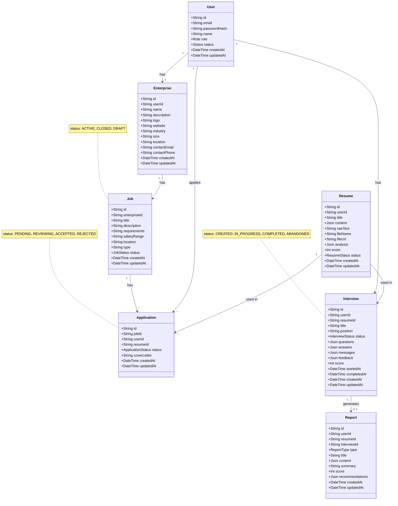
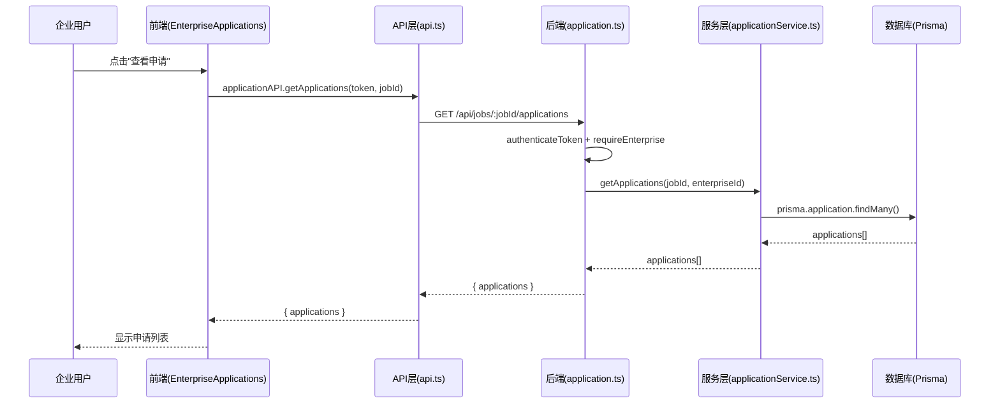
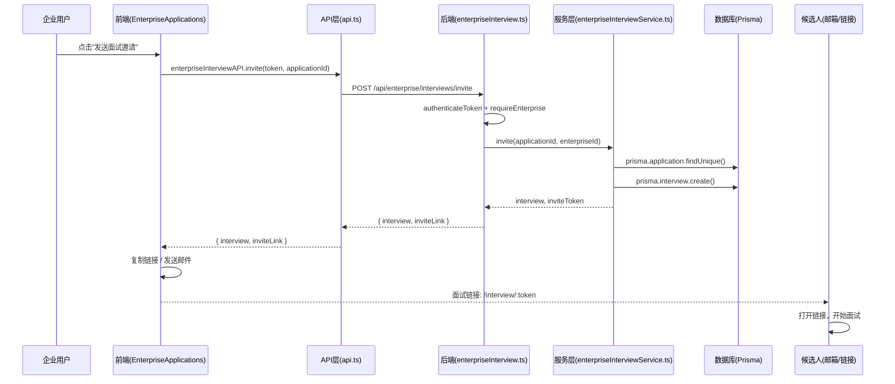
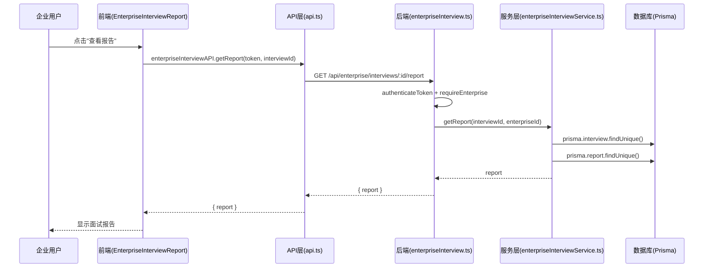
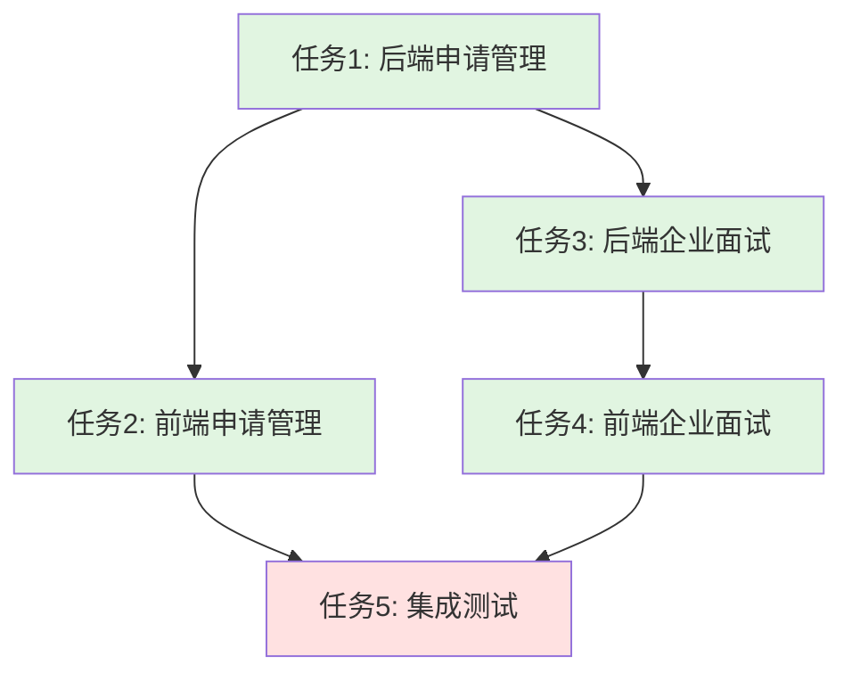

# 简历面试AI助手 - 企业端功能架构设计

**文档版本**: v1.0  
**创建日期**: 2026-06-05  
**架构师**: Bob（高见远）  
**项目**: 简历面试AI助手 - 企业端MVP

---

## Part A: 系统设计

### 0. 已有模块说明

**企业认证模块（已实现）**：

企业注册/登录功能已在现有代码中实现，无需在本次任务中开发。相关证据：

1. **后端路由**：`backend/src/routes/enterprise.ts` 已存在，包含：
   - `POST /register` - 企业注册（第8-54行）
   - `POST /login` - 企业登录（第56-86行）
   - `GET /profile` - 获取企业资料（第89-98行）
   - `PUT /profile` - 更新企业资料（第101-123行）

2. **前端页面**：已存在企业认证相关页面：
   - `frontend/src/pages/EnterpriseLogin.tsx` - 企业登录页面
   - `frontend/src/pages/EnterpriseRegister.tsx` - 企业注册页面

3. **认证中间件**：`backend/src/middleware/auth.ts` 已提供：
   - `authenticateToken` - JWT token验证
   - `requireEnterprise` - 企业权限验证

**结论**：任务列表从任务1（申请管理）开始，无需增加"任务0：企业认证模块"。

---

### 1. 实现方案

#### 1.1 技术难点分析

**难点1：申请管理与简历查看的权限控制**
- **问题**：企业只能查看自己职位收到的申请和简历，不能查看其他企业的数据
- **解决方案**：
  - 后端所有申请相关路由都必须验证 `enterpriseId` 匹配
  - 通过 `Job.enterpriseId` 关联确保数据隔离
  - 使用 `requireEnterprise` 中间件验证企业权限
- **实现要点**：
  - `GET /api/jobs/:jobId/applications` - 验证 job 属于当前企业
  - `PATCH /api/applications/:id/status` - 验证 application.job.enterpriseId 匹配
  - `GET /api/applications/:id/resume` - 验证 application.job.enterpriseId 匹配

**难点2：AI面试邀请与状态追踪**
- **问题**：企业需要向候选人发送面试邀请，并实时追踪面试状态
- **解决方案**：
  - 企业点击"发送面试邀请"后，系统生成面试链接
  - 面试链接包含 token，候选人无需登录即可访问
  - 企业可通过 `GET /api/enterprise/interviews` 查看所有面试状态
  - 面试完成后自动生成报告，企业可查看
- **实现要点**：
  - 创建 `EnterpriseInterview` 模型或使用现有 `Interview` 模型
  - 面试链接格式：`/interview/:token` (公开访问)
  - 面试状态：CREATED → IN_PROGRESS → COMPLETED
  - 报告生成后通知企业（通过WebSocket或轮询）

**难点3：前端页面状态管理与路由守卫**
- **问题**：企业端页面需要统一的身份验证和权限控制
- **解决方案**：
  - 使用 React Router 的 `RequireAuth` 组件守卫企业端路由
  - 本地存储 `token` 和 `user` 信息
  - 所有企业端 API 调用携带 `Authorization: Bearer <token>` header
- **实现要点**：
  - 创建 `EnterpriseLayout` 组件作为企业端页面布局
  - 使用 `useEffect` 检查 token 有效性
  - 未登录用户重定向到 `/enterprise/login`

#### 1.2 框架/库选型

**后端（不变）**：
- Express + TypeScript - Web 框架
- Prisma ORM - 数据库访问
- SQLite - 开发数据库（生产可用 PostgreSQL）
- jsonwebtoken - JWT 认证
- bcryptjs - 密码加密

**前端（不变）**：
- React 18 + TypeScript - UI 框架
- Vite - 构建工具
- Tailwind CSS - 样式框架
- Axios - HTTP 客户端
- React Router DOM - 路由管理

**新增依赖**：
- 无（使用现有框架即可实现所有功能）

---

### 2. 文件列表

#### 2.1 后端文件（新增/修改）

| 文件路径 | 操作 | 说明 |
|---------|------|------|
| `backend/src/routes/application.ts` | 新增 | 申请管理路由（列表、状态更新、简历查看） |
| `backend/src/services/applicationService.ts` | 新增 | 申请管理业务逻辑 |
| `backend/src/routes/enterpriseInterview.ts` | 新增 | 企业面试管理路由（列表、邀请、报告） |
| `backend/src/services/enterpriseInterviewService.ts` | 新增 | 企业面试管理业务逻辑 |
| `backend/src/routes/job.ts` | 修改 | 新增 `GET /api/jobs/:jobId/applications` 端点 |
| `backend/src/routes/interview.ts` | 修改 | 新增企业面试相关端点 |
| `backend/prisma/schema.prisma` | 修改 | 确认 Application 和 Interview 模型字段完整 |

#### 2.2 前端文件（新增/修改）

| 文件路径 | 操作 | 说明 |
|---------|------|------|
| `frontend/src/pages/EnterpriseApplications.tsx` | 新增 | 申请列表页面（查看、筛选、状态更新） |
| `frontend/src/pages/EnterpriseResumeDetail.tsx` | 新增 | 简历详情页面（查看解析后的简历） |
| `frontend/src/pages/EnterpriseInterviewList.tsx` | 新增 | 企业面试列表页面（查看状态、报告） |
| `frontend/src/pages/EnterpriseInterviewReport.tsx` | 新增 | 面试报告页面（查看完整报告） |
| `frontend/src/services/api.ts` | 修改 | 新增 `applicationAPI` 和 `enterpriseInterviewAPI` |
| `frontend/src/App.tsx` | 修改 | 新增企业端路由配置 |

---

### 3. 数据结构与接口



**API 接口定义**：

```typescript
// 申请管理 API
interface ApplicationAPI {
  // 获取职位的申请列表
  getApplications(token: string, jobId: string): Promise<{ applications: Application[] }>
  
  // 更新申请状态
  updateStatus(token: string, id: string, status: 'PENDING' | 'REVIEWING' | 'ACCEPTED' | 'REJECTED'): Promise<{ application: Application }>
  
  // 查看申请简历详情
  getResume(token: string, id: string): Promise<{ resume: Resume }>
}

// 企业面试管理 API
interface EnterpriseInterviewAPI {
  // 获取企业面试列表
  list(token: string): Promise<{ interviews: Interview[] }>
  
  // 发送面试邀请
  invite(token: string, applicationId: string): Promise<{ interview: Interview, inviteLink: string }>
  
  // 查看面试报告
  getReport(token: string, interviewId: string): Promise<{ report: Report }>
}
```

---

### 4. 程序调用流程

#### 4.1 企业查看申请列表流程



#### 4.2 企业发送面试邀请流程



#### 4.3 企业查看面试报告流程



---

### 5. 待明确事项

#### 5.1 面试邀请方式（邮件 vs 链接）

**问题**：面试邀请是通过系统内置邮件发送，还是生成链接由企业自行发送？

**选项**：
- A. 系统自动发送邮件（体验好，但需要配置邮件服务）
- B. 生成面试链接，企业复制后自行发送（灵活，但增加企业操作成本）

**建议**：MVP阶段采用方案B（快速实现），后续增加方案A

#### 5.2 面试报告生成时机

**问题**：面试报告是面试完成后自动生成，还是企业需要手动触发？

**选项**：
- A. 面试完成后自动生成（实时性好）
- B. 企业需要手动点击"生成报告"（可控性强）

**建议**：采用方案A，面试完成后自动生成报告

#### 5.3 简历数据权限控制粒度

**问题**：企业能否下载原始简历文件（PDF/Word），还是只能查看解析后的文本？

**选项**：
- A. 只能查看解析后的文本（保护隐私）
- B. 可以下载原始文件（方便企业）

**建议**：MVP阶段采用方案A，后续增加方案B

#### 5.4 面试链接有效期

**问题**：面试链接是否有有效期限制？

**选项**：
- A. 无有效期（简化实现）
- B. 7天有效期（安全性更好）

**建议**：采用方案B（7天有效期）

---

## Part B: 任务分解

### 6. 依赖包列表

**后端（无新增）**：
- express: ^4.18.2
- @prisma/client: ^5.0.0
- jsonwebtoken: ^9.0.0
- bcryptjs: ^2.4.3
- typescript: ^5.0.0
- ts-node: ^10.9.1

**前端（无新增）**：
- react: ^18.2.0
- react-dom: ^18.2.0
- react-router-dom: ^6.20.0
- axios: ^1.6.0
- typescript: ^5.0.0
- vite: ^5.0.0
- tailwindcss: ^3.3.0

---

### 7. 任务列表

#### 任务1：后端申请管理模块

**描述**：实现申请管理的后端API，包括申请列表、状态更新、简历查看功能

**文件清单**（≥3个文件）：
1. `backend/src/routes/application.ts` - 申请管理路由
2. `backend/src/services/applicationService.ts` - 申请管理业务逻辑
3. `backend/src/routes/job.ts` - 修改，新增申请列表端点

**验收标准**：
- [ ] `GET /api/jobs/:jobId/applications` 返回指定职位的申请列表
- [ ] `PATCH /api/applications/:id/status` 更新申请状态
- [ ] `GET /api/applications/:id/resume` 返回简历详情
- [ ] 所有端点都有企业权限验证

---

#### 任务2：前端申请管理页面

**描述**：实现申请管理的前端页面，包括申请列表、简历详情、状态更新功能

**文件清单**（≥3个文件）：
1. `frontend/src/pages/EnterpriseApplications.tsx` - 申请列表页面
2. `frontend/src/pages/EnterpriseResumeDetail.tsx` - 简历详情页面
3. `frontend/src/services/api.ts` - 修改，新增 `applicationAPI`

**验收标准**：
- [ ] 企业可以查看自己职位的申请列表
- [ ] 点击申请可以查看简历详情
- [ ] 可以更新申请状态（待筛选/已通过/已拒绝）
- [ ] 页面有加载状态和错误处理

---

#### 任务3：后端企业面试管理模块

**描述**：实现企业面试管理的后端API，包括面试列表、邀请发送、报告查看功能

**文件清单**（≥3个文件）：
1. `backend/src/routes/enterpriseInterview.ts` - 企业面试管理路由
2. `backend/src/services/enterpriseInterviewService.ts` - 企业面试管理业务逻辑
3. `backend/src/routes/interview.ts` - 修改，新增企业面试相关端点

**验收标准**：
- [ ] `GET /api/enterprise/interviews` 返回企业的面试列表
- [ ] `POST /api/enterprise/interviews/invite` 发送面试邀请
- [ ] `GET /api/enterprise/interviews/:id/report` 查看面试报告
- [ ] 所有端点都有企业权限验证

---

#### 任务4：前端企业面试管理页面

**描述**：实现企业面试管理的前端页面，包括面试列表、报告查看功能

**文件清单**（≥3个文件）：
1. `frontend/src/pages/EnterpriseInterviewList.tsx` - 面试列表页面
2. `frontend/src/pages/EnterpriseInterviewReport.tsx` - 面试报告页面
3. `frontend/src/services/api.ts` - 修改，新增 `enterpriseInterviewAPI`

**验收标准**：
- [ ] 企业可以查看自己的面试列表
- [ ] 点击面试可以查看完整报告
- [ ] 报告页面显示总分、各维度评分、改进建议
- [ ] 页面有加载状态和错误处理

---

#### 任务5：集成测试与部署

**描述**：对所有企业端功能进行集成测试，并部署到测试环境

**文件清单**（≥3个文件）：
1. `backend/test/application.test.ts` - 申请管理测试用例
2. `backend/test/enterpriseInterview.test.ts` - 企业面试管理测试用例
3. `frontend/src/__tests__/EnterpriseApplications.test.tsx` - 前端集成测试

**验收标准**：
- [ ] 所有API端点都有测试用例
- [ ] 前端页面有集成测试
- [ ] 部署到测试环境并验证功能
- [ ] 修复发现的bug

---

### 8. 共享知识（跨文件约定）

#### 8.1 认证与授权

**后端**：
- 所有企业端API必须使用 `authenticateToken` + `requireEnterprise` 中间件
- `req.user.userId` 获取当前用户ID
- 通过 `prisma.enterprise.findUnique({ where: { userId } })` 获取企业ID

**前端**：
- 所有API调用从 `localStorage.getItem('token')` 获取token
- 使用 `axios` 发送请求，header 包含 `Authorization: Bearer <token>`
- 未登录时重定向到 `/enterprise/login`

#### 8.2 错误处理

**后端**：
- 使用 `try-catch` 捕获错误
- 返回格式：`{ error: string }`
- 常见错误码：400（请求错误）、401（未登录）、403（权限不足）、404（资源不存在）

**前端**：
- 使用 `try-catch` 捕获错误
- 显示错误信息：`err.response?.data?.error || '操作失败'`
- 使用 `alert()` 或 Toast 组件显示错误

#### 8.3 API响应格式

**成功响应**：
```json
{
  "message": "操作成功",
  "data": { ... }
}
```

**错误响应**：
```json
{
  "error": "错误信息"
}
```

#### 8.4 数据库查询优化

**后端**：
- 使用 `prisma.xxx.findMany({ include: { ... } })` 一次性加载关联数据
- 使用 `select` 限制返回字段，减少数据传输
- 使用 `take` 和 `skip` 实现分页

#### 8.5 前端状态管理

**前端**：
- 使用 `useState` 管理组件状态
- 使用 `useEffect` 加载数据
- 使用 `useNavigate` 进行页面跳转

---

### 9. 任务依赖图



**依赖说明**：
- 任务2依赖任务1（前端需要后端API）
- 任务3依赖任务1（面试邀请需要申请数据）
- 任务4依赖任务3（前端需要后端API）
- 任务5依赖任务2和任务4（测试需要完整功能）

---

## 附录

### A. 数据库模型详细说明

#### A.1 Application 模型

```prisma
model Application {
  id          String            @id @default(uuid())
  jobId       String            @map("job_id")
  userId      String            @map("user_id")
  resumeId    String?           @map("resume_id")
  status      ApplicationStatus @default(PENDING) @map("status")
  coverLetter String?           @map("cover_letter")
  createdAt   DateTime          @default(now()) @map("created_at")
  updatedAt   DateTime          @updatedAt @map("updated_at")
  
  job    Job     @relation(fields: [jobId], references: [id])
  user   User    @relation(fields: [userId], references: [id])
  resume Resume? @relation(fields: [resumeId], references: [id])
  
  @@unique([jobId, userId])
  @@map("applications")
}
```

#### A.2 Interview 模型（企业视角）

企业关注的 Interview 字段：
- `id` - 面试ID
- `userId` - 候选人ID
- `resumeId` - 简历ID
- `title` - 面试标题
- `position` - 岗位名称
- `status` - 面试状态（CREATED, IN_PROGRESS, COMPLETED）
- `score` - 面试总分
- `startedAt` - 开始时间
- `completedAt` - 完成时间

### B. API端点完整列表

#### B.1 申请管理 API

| 方法 | 路径 | 说明 | 权限 |
|------|------|------|------|
| GET | `/api/jobs/:jobId/applications` | 获取职位的申请列表 | 企业 |
| PATCH | `/api/applications/:id/status` | 更新申请状态 | 企业 |
| GET | `/api/applications/:id/resume` | 查看申请简历 | 企业 |

#### B.2 企业面试管理 API

| 方法 | 路径 | 说明 | 权限 |
|------|------|------|------|
| GET | `/api/enterprise/interviews` | 获取企业面试列表 | 企业 |
| POST | `/api/enterprise/interviews/invite` | 发送面试邀请 | 企业 |
| GET | `/api/enterprise/interviews/:id/report` | 查看面试报告 | 企业 |

### C. 前端路由配置

```typescript
// frontend/src/App.tsx
<Routes>
  {/* 企业端路由 */}
  <Route path="/enterprise/login" element={<EnterpriseLogin />} />
  <Route path="/enterprise/register" element={<EnterpriseRegister />} />
  <Route path="/enterprise/dashboard" element={<EnterpriseDashboard />} />
  <Route path="/enterprise/jobs" element={<EnterpriseJobs />} />
  <Route path="/enterprise/jobs/new" element={<EnterpriseJobEdit />} />
  <Route path="/enterprise/jobs/:id/edit" element={<EnterpriseJobEdit />} />
  <Route path="/enterprise/applications" element={<EnterpriseApplications />} />
  <Route path="/enterprise/applications/:id/resume" element={<EnterpriseResumeDetail />} />
  <Route path="/enterprise/interviews" element={<EnterpriseInterviewList />} />
  <Route path="/enterprise/interviews/:id/report" element={<EnterpriseInterviewReport />} />
</Routes>
```

---

**文档状态**：✅ 已完成

**下一步行动**：
1. 与团队负责人评审架构设计
2. 确认待明确事项的答案
3. 按任务列表顺序开始开发
4. 每周同步进度和问题
