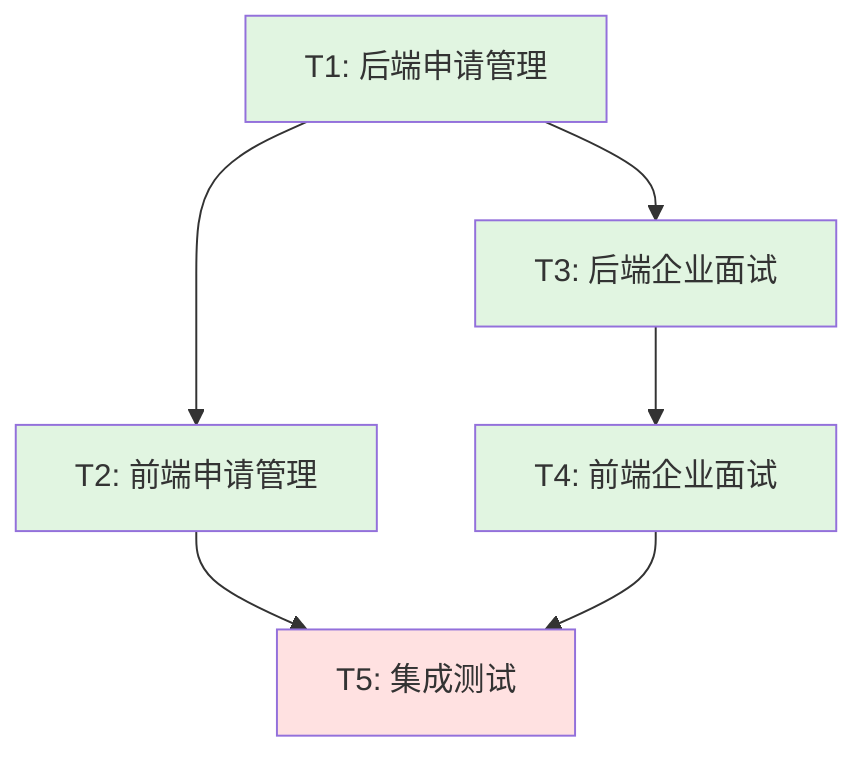

# 企业端功能开发计划

**文档版本**: v1.0  
**创建日期**: 2026-06-05  
**负责人**: arch-enterprise（高见远）  
**项目**: 简历面试AI助手 - 企业端MVP

---

## 1. 开发任务总览

基于架构设计文档（enterprise-architecture.md）的Part B任务分解，企业端功能开发包含以下5个主要任务：

| 任务ID | 任务名称 | 类型 | 预估工作量 | 优先级 |
|--------|---------|------|-----------|--------|
| T1 | 后端申请管理模块 | 后端开发 | 1.5天 (12h) | P0 |
| T2 | 前端申请管理页面 | 前端开发 | 1.5天 (12h) | P0 |
| T3 | 后端企业面试管理模块 | 后端开发 | 1.5天 (12h) | P0 |
| T4 | 前端企业面试管理页面 | 前端开发 | 1.5天 (12h) | P0 |
| T5 | 集成测试与部署 | 测试/运维 | 1天 (8h) | P1 |

**总计**: 7天 (56小时)

---

## 2. 任务详细说明

### T1: 后端申请管理模块

**目标**: 实现申请管理的后端API，包括申请列表、状态更新、简历查看功能

**文件清单**:
1. `backend/src/routes/application.ts` - 申请管理路由（新增）
2. `backend/src/services/applicationService.ts` - 申请管理业务逻辑（新增）
3. `backend/src/routes/job.ts` - 修改，新增申请列表端点

**关键API端点**:
- `GET /api/jobs/:jobId/applications` - 获取职位的申请列表
- `PATCH /api/applications/:id/status` - 更新申请状态
- `GET /api/applications/:id/resume` - 查看申请简历

**验收标准**:
- [ ] 所有API端点功能正常
- [ ] 企业权限验证生效（只能查看自己的数据）
- [ ] 错误处理完善
- [ ] 通过单元测试

**预估工作量**: 1.5天 (12小时)
- 路由实现: 4h
- 服务层实现: 4h
- 测试与调试: 4h

---

### T2: 前端申请管理页面

**目标**: 实现申请管理的前端页面，包括申请列表、简历详情、状态更新功能

**文件清单**:
1. `frontend/src/pages/EnterpriseApplications.tsx` - 申请列表页面（新增）
2. `frontend/src/pages/EnterpriseResumeDetail.tsx` - 简历详情页面（新增）
3. `frontend/src/services/api.ts` - 修改，新增 `applicationAPI`

**关键功能**:
- 企业查看自己职位的申请列表
- 点击申请查看简历详情
- 更新申请状态（待筛选/已通过/已拒绝）
- 加载状态和错误处理

**验收标准**:
- [ ] 页面UI符合设计
- [ ] 功能流程完整
- [ ] 响应式设计
- [ ] 通过集成测试

**预估工作量**: 1.5天 (12小时)
- 申请列表页面: 5h
- 简历详情页面: 4h
- API集成与测试: 3h

---

### T3: 后端企业面试管理模块

**目标**: 实现企业面试管理的后端API，包括面试列表、邀请发送、报告查看功能

**文件清单**:
1. `backend/src/routes/enterpriseInterview.ts` - 企业面试管理路由（新增）
2. `backend/src/services/enterpriseInterviewService.ts` - 企业面试管理业务逻辑（新增）
3. `backend/src/routes/interview.ts` - 修改，新增企业面试相关端点

**关键API端点**:
- `GET /api/enterprise/interviews` - 获取企业面试列表
- `POST /api/enterprise/interviews/invite` - 发送面试邀请
- `GET /api/enterprise/interviews/:id/report` - 查看面试报告

**特殊考虑**:
- 面试链接7天有效期（已在架构文档5.4节确认）
- 面试邀请生成链接，企业自行发送（已在架构文档5.1节确认）

**验收标准**:
- [ ] 所有API端点功能正常
- [ ] 面试链接7天有效期验证
- [ ] 企业权限验证生效
- [ ] 通过单元测试

**预估工作量**: 1.5天 (12小时)
- 路由实现: 4h
- 服务层实现: 4h
- 测试与调试: 4h

---

### T4: 前端企业面试管理页面

**目标**: 实现企业面试管理的前端页面，包括面试列表、报告查看功能

**文件清单**:
1. `frontend/src/pages/EnterpriseInterviewList.tsx` - 面试列表页面（新增）
2. `frontend/src/pages/EnterpriseInterviewReport.tsx` - 面试报告页面（新增）
3. `frontend/src/services/api.ts` - 修改，新增 `enterpriseInterviewAPI`

**关键功能**:
- 企业查看自己的面试列表
- 点击面试查看完整报告
- 报告页面显示总分、各维度评分、改进建议
- 加载状态和错误处理

**验收标准**:
- [ ] 页面UI符合设计
- [ ] 功能流程完整
- [ ] 响应式设计
- [ ] 通过集成测试

**预估工作量**: 1.5天 (12小时)
- 面试列表页面: 4h
- 面试报告页面: 5h
- API集成与测试: 3h

---

### T5: 集成测试与部署

**目标**: 对所有企业端功能进行集成测试，并部署到测试环境

**文件清单**:
1. `backend/test/application.test.ts` - 申请管理测试用例（新增）
2. `backend/test/enterpriseInterview.test.ts` - 企业面试管理测试用例（新增）
3. `frontend/src/__tests__/EnterpriseApplications.test.tsx` - 前端集成测试（新增）

**测试范围**:
- 所有API端点的集成测试
- 前端页面的集成测试
- 权限验证测试
- 错误处理测试

**部署验证**:
- 部署到测试环境
- 验证所有功能
- 修复发现的bug

**验收标准**:
- [ ] 所有测试用例通过
- [ ] 测试覆盖率 > 80%
- [ ] 部署成功
- [ ] 核心功能验证通过

**预估工作量**: 1天 (8小时)
- 后端测试: 3h
- 前端测试: 3h
- 部署与验证: 2h

---

## 3. 任务依赖关系

### 依赖图



### 依赖说明

| 任务 | 依赖任务 | 原因 |
|------|---------|------|
| T2 | T1 | 前端需要后端API接口 |
| T3 | T1 | 面试邀请需要申请数据模型 |
| T4 | T3 | 前端需要后端API接口 |
| T5 | T2, T4 | 测试需要完整功能 |

### 可并行任务

- **T1和T3可以部分并行**: T1完成后，T3可以开始（面试管理依赖申请数据模型）
- **T2和T4可以部分并行**: T2完成后，T4可以开始（但T4依赖T3完成）

**最优并行策略**:
1. 第1-1.5天: T1（后端申请管理）
2. 第1.5-3天: T2（前端申请管理） + T3（后端企业面试）并行
3. 第3-4.5天: T4（前端企业面试）
4. 第5天: T5（集成测试与部署）

---

## 4. 任务分配建议

### 4.1 团队角色分析

**当前团队成员**:
- `team-lead`: 团队负责人，协调全局
- `software-product-manager`: 产品需求文档负责人
- `software-product-manager-2/3/4`: 产品经理
- `software-architect`: 系统架构师（可能是我或其他人）
- `software-architect-2`: 系统架构师
- `pm-optimizer`: 产品经理优化器
- `arch-optimizer`: 架构师优化器

**我的角色**: `arch-enterprise`（企业端架构师）

### 4.2 任务分配方案

#### 方案A：我（arch-enterprise）直接开发

**适用场景**: 我可以直接修改代码，并且有足够时间完成开发

**分配**:
- T1: arch-enterprise（我）
- T2: arch-enterprise（我）
- T3: arch-enterprise（我）
- T4: arch-enterprise（我）
- T5: arch-enterprise（我）

**优点**:
- 架构师直接实现，理解最深
- 沟通成本低
- 质量可控

**缺点**:
- 工作量大，可能延误
- 单点风险

#### 方案B：团队协作开发

**适用场景**: 团队有其他开发者可以协助

**分配建议**:
- **T1（后端申请管理）**: `software-architect` 或 `arch-enterprise`
  - 理由: 后端核心模块，需要架构理解
- **T2（前端申请管理页面）**: `software-product-manager-2` 或前端开发者
  - 理由: 前端页面开发，产品经理可以参与UI实现
- **T3（后端企业面试管理）**: `software-architect-2` 或 `arch-enterprise`
  - 理由: 后端核心模块，需要架构理解
- **T4（前端企业面试管理页面）**: `software-product-manager-3` 或前端开发者
  - 理由: 前端页面开发，产品经理可以参与UI实现
- **T5（集成测试与部署）**: `pm-optimizer` 或 `arch-optimizer`
  - 理由: 测试和优化工作，适合优化角色

**优点**:
- 并行开发，速度快
- 风险分散

**缺点**:
- 需要协调沟通
- 可能理解不一致

### 4.3 推荐方案

**推荐方案B（团队协作开发）**，理由：
1. 开发周期短（7天 vs 单独开发可能需要10-14天）
2. 风险分散（不依赖单点）
3. 符合团队角色定位（架构师负责核心模块，产品经理负责前端页面）

**具体分配建议**:
- **T1**: `arch-enterprise`（我）或 `software-architect`
- **T2**: `software-product-manager-2`
- **T3**: `software-architect-2` 或 `arch-enterprise`（我）
- **T4**: `software-product-manager-3`
- **T5**: `pm-optimizer` 或 `arch-optimizer`

**我（arch-enterprise）的角色**:
- 负责T1或T3（后端核心模块）
- 协助T2和T4的架构指导
- 负责最终代码审查

---

## 5. 开发时间线

### 5.1 Gantt图

```
Day 1    Day 2    Day 3    Day 4    Day 5    Day 6    Day 7
|--------|--------|--------|--------|--------|--------|--------|
[T1      ]                                                 T1: 后端申请管理
         [T2           ][T4      ]                         T2: 前端申请管理
         [T3                ]                               T3: 后端企业面试
                  [T4                     ]                 T4: 前端企业面试
                                       [T5       ]        T5: 集成测试与部署
```

### 5.2 详细时间表

| 天数 | 日期 | 任务 | 负责人 | 产出 |
|------|------|------|--------|------|
| 1 | Day 1 | T1: 后端申请管理（第一天） | arch-enterprise | application.ts, applicationService.ts |
| 2 | Day 2 | T1: 完成 + T2: 前端申请管理（第一天） | arch-enterprise, spm-2 | job.ts修改, EnterpriseApplications.tsx |
| 3 | Day 3 | T2: 完成 + T3: 后端企业面试（第一天） | spm-2, arch-enterprise | EnterpriseResumeDetail.tsx, enterpriseInterview.ts |
| 4 | Day 4 | T3: 完成 + T4: 前端企业面试（第一天） | arch-enterprise, spm-3 | enterpriseInterviewService.ts, EnterpriseInterviewList.tsx |
| 5 | Day 5 | T4: 完成 + T5: 集成测试（第一天） | spm-3, pm-optimizer | EnterpriseInterviewReport.tsx, test files |
| 6 | Day 6 | T5: 测试完成 + 部署 | pm-optimizer | 测试报告, 部署文档 |
| 7 | Day 7 | 缓冲时间 + Bug修复 | 全员 | 最终交付 |

**关键里程碑**:
- Day 2: T1完成（后端申请管理API可用）
- Day 3: T2完成（前端申请管理页面可用）
- Day 4: T3完成（后端企业面试API可用）
- Day 5: T4完成（前端企业面试页面可用）
- Day 6: T5完成（所有测试通过，部署成功）

---

## 6. 风险与应对

### 6.1 技术风险

| 风险 | 影响 | 概率 | 应对措施 |
|------|------|------|---------|
| 企业权限验证复杂 | 高 | 中 | 参考现有enterprise.ts实现，复用中间件 |
| 面试链接7天有效期实现 | 中 | 低 | 在Interview模型增加expiresAt字段 |
| 前端页面状态管理复杂 | 中 | 中 | 使用React Hook，参考现有页面实现 |
| 测试环境部署失败 | 高 | 低 | 提前准备部署脚本，使用Docker |

### 6.2 进度风险

| 风险 | 影响 | 概率 | 应对措施 |
|------|------|------|---------|
| T1延期影响后续任务 | 高 | 中 | 优先完成T1，必要时缩减T1范围 |
| 前端页面开发慢 | 中 | 高 | 使用UI组件库，参考现有页面 |
| 测试发现大量bug | 高 | 中 | 每日构建，持续测试 |

### 6.3 资源风险

| 风险 | 影响 | 概率 | 应对措施 |
|------|------|------|---------|
| 团队成员时间冲突 | 高 | 中 | 提前确认可用性，准备备选方案 |
| 我（arch-enterprise）无法直接修改代码 | 高 | ？ | **需要team-lead确认** |

---

## 7. 交付标准

### 7.1 代码交付

**后端**:
- [ ] `backend/src/routes/application.ts` - 申请管理路由
- [ ] `backend/src/services/applicationService.ts` - 申请管理业务逻辑
- [ ] `backend/src/routes/enterpriseInterview.ts` - 企业面试管理路由
- [ ] `backend/src/services/enterpriseInterviewService.ts` - 企业面试管理业务逻辑
- [ ] `backend/src/routes/job.ts` - 修改（新增申请列表端点）
- [ ] `backend/src/routes/interview.ts` - 修改（新增企业面试端点）

**前端**:
- [ ] `frontend/src/pages/EnterpriseApplications.tsx` - 申请列表页面
- [ ] `frontend/src/pages/EnterpriseResumeDetail.tsx` - 简历详情页面
- [ ] `frontend/src/pages/EnterpriseInterviewList.tsx` - 面试列表页面
- [ ] `frontend/src/pages/EnterpriseInterviewReport.tsx` - 面试报告页面
- [ ] `frontend/src/services/api.ts` - 修改（新增applicationAPI和enterpriseInterviewAPI）

**测试**:
- [ ] `backend/test/application.test.ts` - 申请管理测试
- [ ] `backend/test/enterpriseInterview.test.ts` - 企业面试管理测试
- [ ] `frontend/src/__tests__/EnterpriseApplications.test.tsx` - 前端集成测试

### 7.2 文档交付

- [ ] `docs/enterprise-architecture.md` - 架构设计文档（已完成）
- [ ] `docs/enterprise-development-plan.md` - 开发计划文档（本文档）
- [ ] `docs/enterprise-api-documentation.md` - API文档（待生成）
- [ ] `docs/enterprise-deployment-guide.md` - 部署指南（待生成）

### 7.3 验收标准

**功能验收**:
- [ ] 企业可以查看自己职位的申请列表
- [ ] 企业可以更新申请状态
- [ ] 企业可以查看申请简历（解析后的文本）
- [ ] 企业可以发送面试邀请（生成7天有效链接）
- [ ] 企业可以查看面试列表和报告
- [ ] 所有功能都有企业权限验证

**非功能验收**:
- [ ] API响应时间 < 500ms
- [ ] 前端页面加载时间 < 2s
- [ ] 测试覆盖率 > 80%
- [ ] 部署成功，功能验证通过

---

## 8. 下一步行动

### 8.1 立即行动（等待PRD定稿期间）

1. **确认开发能力**: 我（arch-enterprise）需要确认是否能直接修改代码
   - 如果不能，需要team-lead协调开发者
   - 如果能，我可以开始准备代码框架

2. **准备开发环境**: 
   - 确认数据库schema是否需要修改
   - 准备测试数据
   - 搭建本地开发环境

3. **细化任务**:
   - 将每个任务拆分为更小的子任务（<4小时）
   - 准备详细的实现指南

### 8.2 PRD定稿后行动

1. **启动开发**: 按照时间线开始T1任务
2. **每日同步**: 每天结束时同步进度和问题
3. **代码审查**: 每个任务完成后进行代码审查
4. **持续测试**: 边开发边测试，确保质量

---

## 9. 需要team-lead确认的事项

### 9.1 关键问题

1. **我（arch-enterprise）能否直接修改代码？**
   - 如果能：我可以按照方案A（我直接开发）或方案B（我负责核心模块）
   - 如果不能：需要您协调其他开发者，我提供架构指导

2. **任务分配方案确认**
   - 请确认是否采用方案B（团队协作开发）
   - 请确认具体人员分配（spm-2, spm-3, architect-2等）

3. **开发优先级确认**
   - 当前优先级是P0（所有任务都是P0）
   - 是否需要调整优先级（例如先完成T1+T2，再完成T3+T4）？

4. **测试环境确认**
   - 测试环境是否已经准备好？
   - 如果没有，谁负责准备测试环境？

### 9.2 我的建议

**建议1**: 让我（arch-enterprise）直接修改代码
- 理由: 我是企业端架构师，对系统理解最深，可以直接实现
- 风险: 工作量大，可能需要7-10天
- 缓解: 可以请其他团队成员协助测试和非核心模块

**建议2**: 采用混合方案
- 我负责T1（后端申请管理）和T3（后端企业面试）
- 请spm-2和spm-3负责T2（前端申请管理）和T4（前端企业面试）
- pm-optimizer或arch-optimizer负责T5（集成测试）
- 我提供架构指导和代码审查

**我倾向建议2**，因为：
- 充分利用团队资源
- 降低单点风险
- 加快开发速度

---

## 10. 附录：开发检查清单

### 10.1 每日检查清单

**开始工作前**:
- [ ] 拉取最新代码
- [ ] 运行现有测试，确保通过
- [ ] 确认任务理解和验收标准

**完成工作后**:
- [ ] 代码自审查（符合共享知识第8节规范）
- [ ] 运行单元测试
- [ ] 提交代码（清晰的commit message）
- [ ] 更新任务状态
- [ ] 同步进度给team-lead

### 10.2 任务完成检查清单

**代码完成**:
- [ ] 所有文件已创建/修改
- [ ] 代码符合架构规范（第8节）
- [ ] 没有硬编码，使用配置
- [ ] 错误处理完善

**测试完成**:
- [ ] 单元测试通过
- [ ] 集成测试通过
- [ ] 手动测试关键流程

**文档完成**:
- [ ] API文档更新（如果涉及API变更）
- [ ] README更新（如果需要）
- [ ] 代码注释清晰

---

**文档状态**: ✅ 已确认（team-lead确认，2026-06-05）

**下一步**: 启动开发 - T1任务（后端申请管理模块）
