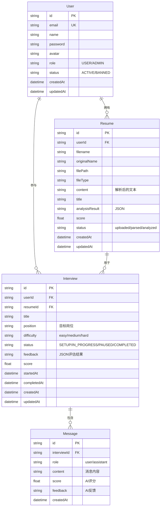

# 第三阶段：整体架构与业务逻辑汇总

> **项目名称**：简历面试AI助手 (Resume Interview AI Assistant)  
> **分析时间**：2026-06-04  
> **分析阶段**：第三阶段 - 整体架构与业务逻辑汇总

---

## 目录

1. [项目概述](#1-项目概述)
2. [系统架构](#2-系统架构)
3. [技术栈详解](#3-技术栈详解)
4. [数据流分析](#4-数据流分析)
5. [核心业务流程](#5-核心业务流程)
6. [模块交互关系](#6-模块交互关系)
7. [数据库设计](#7-数据库设计)
8. [API接口设计](#8-api接口设计)
9. [前端路由架构](#9-前端路由架构)
10. [部署与运行](#10-部署与运行)

---

## 1. 项目概述

### 1.1 项目定位

**简历面试AI助手** 是一个面向求职者的智能化职业发展平台，核心功能包括：

- **简历管理**：上传、解析、分析、优化简历
- **AI模拟面试**：基于简历和岗位要求进行智能面试问答
- **职业指导**：提供职业发展建议和技能趋势预测
- **模板系统**：提供多种简历模板，一键生成格式化简历

### 1.2 核心价值

| 价值维度 | 具体体现 |
|---------|---------|
| **智能化** | 接入腾讯元器AI，实现简历分析、面试问答、职业指导等智能功能 |
| **个性化** | 基于用户简历和岗位需求，提供定制化面试题目和职业建议 |
| **可视化** | 多维度评分雷达图、技能趋势折线图、面试报告可视化 |
| **便捷性** | 支持语音面试、PDF导出、模板一键应用等便捷功能 |

### 1.3 目标用户

- **主要用户**：应届毕业生、职场新人、转行求职者
- **使用场景**：简历制作与优化、面试准备、职业规划

---

## 2. 系统架构

### 2.1 整体架构图

```
┌─────────────────────────────────────────────────────────────────────────┐
│                          用户层 (User Layer)                           │
│                 浏览器 / 移动端浏览器 / PWA                            │
└────────────────────────────────┬────────────────────────────────────────┘
                                 │ HTTPS
┌────────────────────────────────▼────────────────────────────────────────┐
│                     前端层 (Frontend Layer)                            │
│  ┌─────────────────────────────────────────────────────────────────┐   │
│  │          React 18 + TypeScript + Vite + Tailwind CSS           │   │
│  │  ┌──────────┐ ┌──────────┐ ┌──────────┐ ┌──────────┐         │   │
│  │  │  Pages   │ │Components│ │  Context │ │   Hooks  │         │   │
│  │  └──────────┘ └──────────┘ └──────────┘ └──────────┘         │   │
│  │  React Router │  Recharts  │  Speech API  │  jsPDF         │   │
│  └─────────────────────────────────────────────────────────────────┘   │
│                           Port: 5173 (Dev)                            │
└────────────────────────────────┬────────────────────────────────────────┘
                                 │ RESTful API
┌────────────────────────────────▼────────────────────────────────────────┐
│                     后端层 (Backend Layer)                             │
│  ┌─────────────────────────────────────────────────────────────────┐   │
│  │        Node.js + TypeScript + Express + Prisma ORM             │   │
│  │  ┌──────────┐ ┌──────────┐ ┌──────────┐ ┌──────────┐         │   │
│  │  │ Routes   │ │Controllers│ │Middleware│ │  Services│         │   │
│  │  └──────────┘ └──────────┘ └──────────┘ └──────────┘         │   │
│  │  Auth │ Upload │ Resume │ Interview │ Admin │ AI Proxy       │   │
│  └─────────────────────────────────────────────────────────────────┘   │
│                         Port: 3000 (Dev)                              │
└────────────────────────────────┬────────────────────────────────────────┘
         ┌────────────────────────┼────────────────────────┐
         │                        │                        │
┌────────▼────────┐   ┌─────────▼──────────┐   ┌────────▼───────────┐
│  数据库层        │   │   文件存储层        │   │   AI服务层         │
│  PostgreSQL     │   │  Local Upload/     │   │  腾讯元器 API      │
│  (Neon)        │   │  OSS (可选)       │   │  (Mock Mode)      │
│                 │   │                   │   │                   │
│  Users         │   │  Resumes/         │   │  /api/v2.0/      │
│  Resumes       │   │  Avatars/         │   │  knowledge/      │
│  Interviews    │   │  Exports/         │   │  chat/           │
│  Messages      │   │                   │   │                  │
└────────────────┘   └───────────────────┘   └────────────────────┘
```

### 2.2 架构特点

| 特点 | 说明 |
|-----|------|
| **前后端分离** | 前端React SPA + 后端RESTful API，独立开发部署 |
| **分层架构** | 后端采用Routes → Controllers → Services分层，职责清晰 |
| **ORM数据访问** | 使用Prisma ORM，类型安全的数据库操作 |
| **AI服务抽象** | AI调用封装在controller层，支持Mock模式降级 |
| **文件存储灵活** | 支持本地存储和云存储（OSS）两种模式 |

### 2.3 技术选型理由

**前端技术栈**：
- **React 18**：成熟的组件化框架，生态丰富
- **TypeScript**：类型安全，减少运行时错误
- **Vite**：快速的开发服务器和构建工具
- **Tailwind CSS**： utility-first CSS框架，快速开发
- **Recharts**：React图表库，响应式设计

**后端技术栈**：
- **Node.js + Express**：JavaScript全栈，前后端语言统一
- **TypeScript**：后端也需要类型安全
- **Prisma**：现代ORM，迁移管理方便
- **PostgreSQL**：成熟的关系型数据库，支持JSON字段
- **JWT**：无状态认证，适合SPA应用

---

## 3. 技术栈详解

### 3.1 前端技术栈

#### 核心框架
```json
{
  "react": "^18.3.1",
  "react-router-dom": "^7.1.0",
  "typescript": "~5.6.2"
}
```

#### UI与样式
```json
{
  "tailwindcss": "^3.4.17",
  "postcss": "^8.4.49",
  "autoprefixer": "^10.4.20"
}
```

#### 功能库
```json
{
  "recharts": "^2.15.3",       // 图表
  "jspdf": "^2.5.2",           // PDF生成
  "html2canvas": "^1.4.1",     // HTML转Canvas
  "axios": "^1.7.9",           // HTTP客户端
  "react-markdown": "^9.0.1"   // Markdown渲染
}
```

#### 开发工具
```json
{
  "vite": "^6.0.5",
  "eslint": "^9.17.0",
  "@types/react": "^18.3.18"
}
```

### 3.2 后端技术栈

#### 核心框架
```json
{
  "express": "^4.21.2",
  "cors": "^2.8.5",
  "helmet": "^8.1.0"
}
```

#### 数据库与ORM
```json
{
  "prisma": "^6.2.0",
  "@prisma/client": "^6.2.0"
}
```

#### 文件处理
```json
{
  "multer": "^1.4.5-lts.1",
  "pdf-parse": "^1.1.1",
  "mammoth": "^1.8.0"
}
```

#### AI与工具
```json
{
  "axios": "^1.7.9",
  "bcryptjs": "^3.0.2",
  "jsonwebtoken": "^9.0.2",
  "dayjs": "^1.11.13"
}
```

### 3.3 开发环境

| 工具 | 版本 | 用途 |
|-----|------|------|
| Node.js | v22+ | 运行环境 |
| npm | v10+ | 包管理 |
| Git | 2.x | 版本控制 |
| PostgreSQL | 15+ | 数据库（Neon云数据库） |

---

## 4. 数据流分析

### 4.1 用户认证数据流

```
┌─────────┐   登录请求    ┌─────────┐   验证用户   ┌─────────┐
│  Front  │ ──────────>  │  Back  │ ──────────> │  DB     │
│  end    │              │  end   │              │  (User) │
└─────────┘              └─────────┘              └─────────┘
                               │
                               │ 验证通过
                               ▼
                          ┌─────────┐
                          │ 生成JWT │
                          │  Token  │
                          └─────────┘
                               │
                               ▼
┌─────────┐  返回Token    ┌─────────┐
│  Front  │ <──────────   │  Back  │
│  end    │              │  end   │
└─────────┘              └─────────┘
    │
    │ 存储Token到localStorage
    ▼
┌─────────┐   后续请求     ┌─────────┐
│  Front  │ ──────────>  │  Back  │
│  end    │ Authorization  │  end   │
│         │ Bearer Token  │        │
└─────────┘              └─────────┘
```

### 4.2 简历上传与解析数据流

```
┌─────────┐ 上传简历文件  ┌─────────┐  保存文件  ┌─────────┐
│  Front  │ ──────────>  │  Back  │ ─────────> │  Disk  │
│  end    │  FormData    │  end   │            │ /upload│
└─────────┘              └─────────┘            └─────────┘
                                       │
                                       │ 调用解析
                                       ▼
                                  ┌─────────┐
                                  │ pdf-   │
                                  │ parse/ │
                                  │ mammoth│
                                  └─────────┘
                                       │
                                       │ 提取文本
                                       ▼
                                  ┌─────────┐
                                  │ 更新   │
                                  │ Resume │
                                  │ 记录   │
                                  └─────────┘
                                       │
                                       ▼
┌─────────┐  返回解析结果  ┌─────────┐
│  Front  │ <──────────   │  Back  │
│  end    │              │  end   │
└─────────┘              └─────────┘
```

### 4.3 AI面试数据流

```
┌─────────┐ 开始面试请求  ┌─────────┐  查询简历  ┌─────────┐
│  Front  │ ──────────>  │  Back  │ ─────────> │  DB     │
│  end    │              │  end   │            │ (Resume)│
└─────────┘              └─────────┘            └─────────┘
                                       │
                                       │ 调用AI生成问题
                                       ▼
                                  ┌─────────┐
                                  │ 腾讯   │
                                  │ 元器   │
                                  │ API    │
                                  └─────────┘
                                       │
                                       │ 返回第一个问题
                                       ▼
┌─────────┐  显示问题    ┌─────────┐
│  Front  │ <──────────   │  Back  │
│  end    │              │  end   │
└─────────┘              └─────────┘
    │
    │ 用户回答（语音/文字）
    ▼
┌─────────┐ 提交回答    ┌─────────┐  调用AI评估  ┌─────────┐
│  Front  │ ──────────>  │  Back  │ ─────────> │ 腾讯   │
│  end    │              │  end   │            │ 元器   │
└─────────┘              └─────────┘            │ API    │
                                       │       └─────────┘
                                       │ 返回评估+下一题
                                       ▼
                                  ┌─────────┐
                                  │ 保存    │
                                  │ Message │
                                  │ +评分   │
                                  └─────────┘
                                       │
                                       ▼
┌─────────┐ 显示评估结果  ┌─────────┐
│  Front  │ <──────────   │  Back  │
│  end    │              │  end   │
└─────────┘              └─────────┘
```

### 4.4 简历优化数据流

```
┌─────────┐ 提交优化请求  ┌─────────┐  获取简历  ┌─────────┐
│  Front  │ ──────────>  │  Back  │ ─────────> │  DB     │
│  end    │ (简历+目标岗位)│  end   │            │(Resume) │
└─────────┘              └─────────┘            └─────────┘
                                       │
                                       │ 调用AI优化
                                       ▼
                                  ┌─────────┐
                                  │ 腾讯   │
                                  │ 元器   │
                                  │ API    │
                                  └─────────┘
                                       │
                                       │ 返回优化后简历
                                       ▼
┌─────────┐ 显示对比界面  ┌─────────┐
│  Front  │ <──────────   │  Back  │
│  end    │ (优化前vs优化后)│  end   │
└─────────┘              └─────────┘
    │
    │ 用户查看差异
    ▼
┌─────────┐ 应用优化结果  ┌─────────┐
│  Front  │ ──────────>  │  Back  │
│  end    │              │  end   │
└─────────┘              └─────────┘
```

---

## 5. 核心业务流程

### 5.1 用户注册登录流程

```
┌──────────┐
│ 用户访问  │
│ 首页     │
└────┬─────┘
     │ 点击登录/注册
     ▼
┌──────────┐   输入信息   ┌──────────┐
│ 登录/注册 │ ──────────> │ 后端API  │
│ 页面     │             │ /auth/  │
└──────────┘             └────┬─────┘
                              │
              ┌───────────────┼───────────────┐
              │               │               │
         验证失败          验证成功        注册成功
              │               │               │
              ▼               ▼               ▼
         ┌────────┐    ┌────────┐    ┌────────┐
         │ 显示   │    │ 返回   │    │ 创建   │
         │ 错误   │    │ Token  │    │ 用户   │
         └────────┘    └───┬────┘    └───┬────┘
                            │            │
                            ▼            ▼
                       ┌────────┐   ┌────────┐
                       │ 存储   │   │ 跳转   │
                       │ Token  │   │ 首页   │
                       └────────┘   └────────┘
```

### 5.2 简历上传与分析流程

```
┌──────────┐
│ 用户进入  │
│ 简历上传  │
│ 页面     │
└────┬─────┘
     │ 选择文件（PDF/DOCX）
     ▼
┌──────────┐   上传文件   ┌──────────┐
│ 前端     │ ──────────> │ 后端     │
│          │ FormData    │ /resumes │
└──────────┘             └────┬─────┘
                               │
                               │ Multer接收文件
                               ▼
                          ┌──────────┐
                          │ 文件     │
                          │ 保存到   │
                          │ /upload  │
                          └────┬─────┘
                               │
                               │ 调用解析库
                               ▼
                          ┌──────────┐
                          │ pdf-parse│
                          │ /mammoth│
                          └────┬─────┘
                               │
                               │ 提取文本内容
                               ▼
                          ┌──────────┐
                          │ 更新    │
                          │ Resume  │
                          │ 记录    │
                          └────┬─────┘
                               │
                               │ 调用AI分析（可选）
                               ▼
                          ┌──────────┐
                          │ 腾讯元器 │
                          │ API      │
                          └────┬─────┘
                               │
                               │ 返回分析结果
                               ▼
                          ┌──────────┐
                          │ 更新    │
                          │ 分析    │
                          │ 结果    │
                          └────┬─────┘
                               │
                               ▼
                          ┌──────────┐
                          │ 返回    │
                          │ 完整    │
                          │ 简历数据 │
                          └──────────┘
```

### 5.3 模拟面试流程

```
┌──────────┐
│ 用户创建  │
│ 新面试   │
│ (选择简历 │
│  目标岗位)│
└────┬─────┘
     │
     ▼
┌──────────┐   创建面试   ┌──────────┐
│ 前端     │ ──────────> │ 后端     │
│          │             │ /interviews│
└──────────┘             └────┬─────┘
                               │
                               │ 创建Interview记录
                               ▼
                          ┌──────────┐
                          │ 调用AI   │
                          │ 生成第一 │
                          │ 个问题   │
                          └────┬─────┘
                               │
                               │ 返回第一个问题
                               ▼
                          ┌──────────┐
                          │ 前端显示 │
                          │ 面试室   │
                          │ 界面     │
                          └────┬─────┘
                               │
                               │ 用户回答（语音/文字）
                               ▼
                          ┌──────────┐
                          │ 提交回答 │
                          │ 到后端   │
                          └────┬─────┘
                               │
                               │ 调用AI评估+下一题
                               ▼
                          ┌──────────┐
                          │ 保存    │
                          │ Message │
                          │ 记录    │
                          └────┬─────┘
                               │
                               │ 返回评估结果
                               ▼
                          ┌──────────┐
                          │ 前端显示 │
                          │ 评估结果 │
                          │ +下一题  │
                          └────┬─────┘
                               │
              ┌────────────────┼────────────────┐
              │                │                │
          还有问题           用户结束          达到最大
              │                │                │
              ▼                ▼                ▼
         ┌────────┐      ┌────────┐      ┌────────┐
         │ 继续   │      │ 生成   │      │ 生成   │
         │ 下一题 │      │ 报告   │      │ 报告   │
         └────────┘      └────────┘      └────────┘
```

### 5.4 简历优化流程

```
┌──────────┐
│ 用户进入  │
│ 工具-    │
│ 优化页面 │
└────┬─────┘
     │ 选择简历+目标岗位+优化模式
     ▼
┌──────────┐   提交优化   ┌──────────┐
│ 前端     │ ──────────> │ 后端     │
│          │             │ /tools/  │
│          │             │ optimize │
└──────────┘             └────┬─────┘
                               │
                               │ Step 1: 计算优化前匹配度
                               ▼
                          ┌──────────┐
                          │ 调用AI   │
                          │ 计算JD   │
                          │ 匹配度   │
                          └────┬─────┘
                               │
                               │ Step 2: AI优化简历
                               ▼
                          ┌──────────┐
                          │ 调用腾讯 │
                          │ 元器API  │
                          │ 优化简历 │
                          └────┬─────┘
                               │
                               │ Step 3: 计算优化后匹配度
                               ▼
                          ┌──────────┐
                          │ 调用AI   │
                          │ 计算新   │
                          │ 匹配度   │
                          └────┬─────┘
                               │
                               │ 返回对比结果
                               ▼
                          ┌──────────┐
                          │ 前端显示 │
                          │ 优化前vs │
                          │ 优化后   │
                          │ 对比界面 │
                          └────┬─────┘
                               │
                               │ 用户选择应用优化结果
                               ▼
                          ┌──────────┐
                          │ 更新    │
                          │ 简历内容 │
                          └──────────┘
```

---

## 6. 模块交互关系

### 6.1 前端模块依赖图

```
App.tsx (入口)
├── context/
│   ├── AuthContext.tsx (认证状态)
│   └── ThemeContext.tsx (主题状态)
├── components/
│   ├── Layout.tsx (主布局)
│   ├── AdminLayout.tsx (管理布局)
│   ├── ResumeCard.tsx (简历卡片)
│   └── VoiceWave.tsx (语音波形)
└── pages/
    ├── Home.tsx (首页)
    ├── Login.tsx / Register.tsx (认证)
    ├── Dashboard.tsx (仪表盘)
    ├── ResumeUpload.tsx / ResumeList.tsx / ResumeDetail.tsx (简历管理)
    ├── InterviewNew.tsx / InterviewRoom.tsx / InterviewReport.tsx / InterviewList.tsx (面试)
    ├── ToolsScore.tsx / ToolsMatch.tsx / ToolsOptimize.tsx / ToolsQuestions.tsx / ToolsGuide.tsx (工具)
    ├── Templates.tsx / TemplateApply.tsx (模板)
    ├── ReportCenter.tsx (报告中心)
    ├── Profile.tsx (个人设置)
    └── AdminDashboard.tsx / AdminUsers.tsx (管理)
```

### 6.2 后端模块依赖图

```
src/
├── index.ts (入口)
├── middleware/
│   └── auth.ts (认证中间件)
├── routes/
│   ├── auth.ts (认证路由)
│   ├── users.ts (用户路由)
│   ├── resumes.ts (简历路由)
│   ├── interviews.ts (面试路由)
│   ├── messages.ts (消息路由)
│   ├── upload.ts (上传路由)
│   ├── tools.ts (工具路由)
│   └── admin.ts (管理路由)
├── controllers/
│   ├── authController.ts
│   ├── userController.ts
│   ├── resumeController.ts
│   ├── interviewController.ts
│   ├── messageController.ts
│   ├── uploadController.ts
│   ├── toolsController.ts
│   └── adminController.ts
└── lib/
    ├── prisma.ts (Prisma客户端)
    └── logger.ts (日志)
```

### 6.3 前后端API映射

| 前端API模块 | 后端路由 | 功能 |
|-----------|---------|------|
| authAPI | /api/auth/* | 登录、注册、资料更新、密码修改、头像上传 |
| resumeAPI | /api/resumes/* | 简历CRUD、分析、模板应用 |
| interviewAPI | /api/interviews/* | 面试CRUD、开始/回答问题、消息历史 |
| messageAPI | /api/messages/* | 消息CRUD（面试中的问答记录） |
| toolsAPI | /api/tools/* | 简历评分、JD匹配、优化、出题、职业指导 |
| uploadAPI | /api/upload | 文件上传 |
| adminAPI | /api/admin/* | 管理员功能（统计、用户管理） |

---

## 7. 数据库设计

### 7.1 ER图（Mermaid）



### 7.2 表结构详解

#### User表
```prisma
model User {
  id        String   @id @default(cuid())
  email     String   @unique
  name      String?
  password  String
  avatar    String?
  role      String   @default("USER") // USER, ADMIN
  status    String   @default("ACTIVE") // ACTIVE, BANNED
  createdAt DateTime @default(now())
  updatedAt DateTime @updatedAt
  
  resumes    Resume[]
  interviews Interview[]
}
```

**字段说明**：
- `id`: CUID格式，比UUID更短且有序
- `email`: 唯一索引，用于登录
- `password`: bcrypt哈希存储
- `role`: 权限控制（USER普通用户，ADMIN管理员）
- `status`: 账户状态（ACTIVE正常，BANNED封禁）

#### Resume表
```prisma
model Resume {
  id              String   @id @default(cuid())
  userId          String
  filename        String   // 存储文件名
  originalName    String   // 原始文件名
  filePath        String   // 文件路径
  fileType        String   // pdf, docx
  content         String?  // 解析后的文本内容
  title           String?  // 用户定义的简历标题
  analysisResult  String?  // AI分析结果（JSON字符串）
  score           Float?   // 简历评分
  status          String   @default("uploaded") // uploaded, parsed, analyzed
  createdAt       DateTime @default(now())
  updatedAt       DateTime @updatedAt
  
  user       User       @relation(fields: [userId], references: [id])
  interviews Interview[]
}
```

**字段说明**：
- `content`: 存储PDF/DOCX解析后的纯文本，用于AI分析
- `analysisResult`: JSON字符串，包含AI分析的详细结果（维度分数、建议等）
- `status`: 简历处理状态流转：`uploaded` → `parsed` → `analyzed`

#### Interview表
```prisma
model Interview {
  id           String   @id @default(cuid())
  userId       String
  resumeId     String?
  title        String?
  position     String?  // 目标岗位
  difficulty   String   @default("medium") // easy, medium, hard
  status       String   @default("SETUP") // SETUP, IN_PROGRESS, PAUSED, COMPLETED
  feedback     String?  // 最终反馈JSON
  score        Float?   // 总体得分
  startedAt    DateTime?
  completedAt  DateTime?
  createdAt    DateTime @default(now())
  updatedAt    DateTime @updatedAt
  
  user     User     @relation(fields: [userId], references: [id])
  resume   Resume?  @relation(fields: [resumeId], references: [id])
  messages Message[]
}
```

**字段说明**：
- `status`: 面试状态机：`SETUP` → `IN_PROGRESS` → `COMPLETED`（或`PAUSED`）
- `feedback`: JSON字符串，包含面试整体评估、维度分析、改进建议
- `startedAt`/`completedAt`: 用于计算面试时长

#### Message表
```prisma
model Message {
  id           String   @id @default(cuid())
  interviewId  String
  role         String   // user, assistant
  content      String   // 消息内容
  score        Float?   // AI评分（仅assistant消息）
  feedback     String?  // AI反馈（仅assistant消息）
  createdAt    DateTime @default(now())
  
  interview Interview @relation(fields: [interviewId], references: [id])
}
```

**字段说明**：
- `role`: `user`（用户回答）或`assistant`（AI问题/评估）
- `score`/`feedback`: 仅当`role=assistant`且有评估时填充

### 7.3 索引设计

```prisma
// 已定义的索引
User {
  email String @unique // 唯一索引，加速登录查询
}

Resume {
  userId String // 外键索引，加速按用户查询简历
}

Interview {
  userId String // 外键索引，加速按用户查询面试
}

Message {
  interviewId String // 外键索引，加速按面试查询消息
}
```

**建议添加的索引**：
```prisma
// 简历按创建时间查询（用户简历列表页）
+ index([userId, createdAt])

// 面试按状态和创建时间查询（面试列表页）
+ index([userId, status, createdAt])

// 消息按面试ID和创建时间查询（面试室加载历史消息）
+ index([interviewId, createdAt])
```

---

## 8. API接口设计

### 8.1 认证API

#### POST /api/auth/register
**请求体**：
```json
{
  "email": "user@example.com",
  "password": "password123",
  "name": "张三"
}
```

**响应**：
```json
{
  "success": true,
  "data": {
    "token": "eyJhbG...",
    "user": {
      "id": "cj123...",
      "email": "user@example.com",
      "name": "张三",
      "role": "USER"
    }
  }
}
```

#### POST /api/auth/login
**请求体**：
```json
{
  "email": "user@example.com",
  "password": "password123"
}
```

**响应**：同register

#### GET /api/auth/me
**Headers**: `Authorization: Bearer <token>`

**响应**：
```json
{
  "success": true,
  "data": {
    "id": "cj123...",
    "email": "user@example.com",
    "name": "张三",
    "avatar": "/upload/avatars/123.png",
    "role": "USER"
  }
}
```

### 8.2 简历API

#### GET /api/resumes
**Query**: `?page=1&pageSize=10`

**响应**：
```json
{
  "success": true,
  "data": {
    "resumes": [
      {
        "id": "res123",
        "title": "我的简历",
        "filename": "resume.pdf",
        "status": "analyzed",
        "score": 85.5,
        "createdAt": "2026-06-04T12:00:00Z"
      }
    ],
    "pagination": {
      "page": 1,
      "pageSize": 10,
      "total": 25,
      "totalPages": 3
    }
  }
}
```

#### POST /api/resumes/upload
**Content-Type**: `multipart/form-data`

**请求体**：
```
file: <binary>
title: 我的简历
```

**响应**：
```json
{
  "success": true,
  "data": {
    "id": "res123",
    "filename": "resume.pdf",
    "status": "uploaded",
    "message": "文件上传成功，正在解析..."
  }
}
```

#### GET /api/resumes/:id/analysis
**响应**：
```json
{
  "success": true,
  "data": {
    "resumeId": "res123",
    "analysisResult": {
      "overall_score": 85,
      "dimensions": {
        "content_quality": 80,
        "structure_norm": 90,
        "keyword_match": 85,
        "readability": 88
      },
      "suggestions": ["建议添加量化成果", "..."]
    }
  }
}
```

### 8.3 面试API

#### POST /api/interviews
**请求体**：
```json
{
  "resumeId": "res123",
  "title": "产品助理面试",
  "position": "产品助理",
  "difficulty": "medium"
}
```

**响应**：
```json
{
  "success": true,
  "data": {
    "id": "int123",
    "title": "产品助理面试",
    "status": "SETUP",
    "createdAt": "2026-06-04T12:00:00Z"
  }
}
```

#### POST /api/interviews/:id/start
**响应**：
```json
{
  "success": true,
  "data": {
    "interviewId": "int123",
    "firstQuestion": "请介绍一下你自己",
    "status": "IN_PROGRESS"
  }
}
```

#### POST /api/interviews/:id/answer
**请求体**：
```json
{
  "content": "我叫张三，毕业于...",
  "messageId": "msg123" // 可选，如果是继续回答
}
```

**响应**：
```json
{
  "success": true,
  "data": {
    "evaluation": {
      "score": 85,
      "feedback": "回答思路清晰，但缺少具体案例..."
    },
    "nextQuestion": "你为什么选择我们公司？",
    "isCompleted": false
  }
}
```

### 8.4 工具API

#### POST /api/tools/score
**请求体**：
```json
{
  "resume": "张三的简历内容...",
  "jd": "产品助理岗位要求..."
}
```

**响应**：
```json
{
  "success": true,
  "data": {
    "overall_score": 78,
    "dimension_scores": {
      "content_quality": 75,
      "structure_norm": 85,
      "keyword_match": 70,
      "readability": 82
    },
    "improvement_suggestions": ["..."],
    "next_steps": ["建议补充项目经历", "..."]
  }
}
```

#### POST /api/tools/match
**请求体**：
```json
{
  "resume": "张三的简历内容...",
  "jd": "Java开发工程师岗位要求..."
}
```

**响应**：
```json
{
  "success": true,
  "data": {
    "match_score": 72,
    "match_dimensions": {
      "hard_skills": 65,
      "soft_skills": 80,
      "experience": 70,
      "education": 85,
      "potential": 75
    },
    "overpackaging_words": [
      {
        "word": "精通",
        "sentence": "精通Java编程",
        "has_support": false
      }
    ],
    "suggestions": ["..."]
  }
}
```

---

## 9. 前端路由架构

### 9.1 路由表

```typescript
// 公开路由（无需登录）
<Route path="/" element={<Home />} />
<Route path="/login" element={<Login />} />
<Route path="/register" element={<Register />} />

// 受保护路由（需要登录）
<Route path="/dashboard" element={<Dashboard />} />
<Route path="/resumes" element={<ResumeList />} />
<Route path="/resumes/upload" element={<ResumeUpload />} />
<Route path="/resumes/:id" element={<ResumeDetail />} />
<Route path="/interviews" element={<InterviewList />} />
<Route path="/interviews/new" element={<InterviewNew />} />
<Route path="/interviews/:id/room" element={<InterviewRoom />} />
<Route path="/interviews/:id/report" element={<InterviewReport />} />
<Route path="/tools/score" element={<ToolsScore />} />
<Route path="/tools/match" element={<ToolsMatch />} />
<Route path="/tools/optimize" element={<ToolsOptimize />} />
<Route path="/tools/questions" element={<ToolsQuestions />} />
<Route path="/tools/guide" element={<ToolsGuide />} />
<Route path="/templates" element={<Templates />} />
<Route path="/templates/:id/apply" element={<TemplateApply />} />
<Route path="/reports" element={<ReportCenter />} />
<Route path="/profile" element={<Profile />} />

// 管理员路由（需要ADMIN角色）
<Route path="/admin" element={<AdminLayout />}>
  <Route index element={<AdminDashboard />} />
  <Route path="users" element={<AdminUsers />} />
</Route>
```

### 9.2 路由守卫

**认证守卫**（`AuthContext.tsx`）：
```typescript
// 检查token是否存在
const token = localStorage.getItem('token');
if (!token) {
  navigate('/login');
  return;
}

// 验证token有效性
const verifyToken = async () => {
  try {
    await authAPI.getMe(token);
  } catch (error) {
    localStorage.removeItem('token');
    navigate('/login');
  }
};
```

**管理员守卫**（`AdminLayout.tsx`）：
```typescript
const user = JSON.parse(localStorage.getItem('user') || '{}');
if (user.role !== 'ADMIN') {
  navigate('/dashboard');
  return;
}
```

---

## 10. 部署与运行

### 10.1 开发环境运行

**后端**：
```bash
cd backend
npm install
npm run dev # nodemon + ts-node
```

**前端**：
```bash
cd frontend
npm install
npm run dev # vite dev server
```

**环境变量**：
```bash
# backend/.env
DATABASE_URL="postgresql://..."
JWT_SECRET="your-secret"
YUANQI_TOKEN="tencent-yuanqi-token"
```

### 10.2 生产环境构建

**前端构建**：
```bash
cd frontend
npm run build # 输出到 dist/
```

**后端构建**：
```bash
cd backend
npm run build # tsc编译到dist/
npm start # node dist/index.js
```

### 10.3 部署架构建议

```
用户
 │
 ▼
CDN (静态资源)
 │
 ▼
Nginx (反向代理)
 ├── /api/* → Backend (Node.js)
 └── /* → Frontend (静态文件)
      │
      ▼
 PostgreSQL (数据库)
      │
      ▼
 对象存储 (文件)
```

---

## 11. 性能优化建议

### 11.1 前端优化

| 优化点 | 当前状态 | 建议方案 |
|-------|---------|---------|
| 代码分割 | ❌ 未实现 | 使用React.lazy()按需加载页面组件 |
| 图片优化 | ❌ 未实现 | 使用WebP格式，添加loading="lazy" |
| 虚拟滚动 | ❌ 未实现 | 长列表使用react-window虚拟化 |
| 缓存策略 | ⚠️ 仅localStorage | 添加Service Worker缓存API响应 |
| 打包优化 | ⚠️ 基础配置 | 分析bundle大小，移除未使用代码 |

### 11.2 后端优化

| 优化点 | 当前状态 | 建议方案 |
|-------|---------|---------|
| 数据库索引 | ⚠️ 基础索引 | 添加复合索引优化查询性能 |
| API缓存 | ❌ 未实现 | 对AI调用结果添加Redis缓存 |
| 连接池 | ⚠️ 默认配置 | 配置Prisma连接池参数 |
| 压缩中间件 | ❌ 未实现 | 添加compression中间件 |
| 限流防护 | ❌ 未实现 | 添加rate-limiter防止滥用 |

### 11.3 AI调用优化

| 优化点 | 当前状态 | 建议方案 |
|-------|---------|---------|
| Mock模式 | ✅ 已实现 | 保持，用于开发和测试 |
| 结果缓存 | ❌ 未实现 | 相同输入缓存AI响应，减少API调用 |
| 超时处理 | ⚠️ 基础实现 | 添加更细致的超时和重试逻辑 |
| 并发控制 | ❌ 未实现 | 限制同时AI调用数量，避免超限 |

---

## 12. 安全性分析

### 12.1 已实施的安全措施

| 措施 | 状态 | 说明 |
|-----|------|------|
| HTTPS | ⚠️ 依赖部署 | 生产环境应强制HTTPS |
| JWT认证 | ✅ 已实现 | Token存储在localStorage |
| 密码哈希 | ✅ 已实现 | 使用bcryptjs哈希存储 |
| CORS配置 | ✅ 已实现 | 后端配置了cors中间件 |
| Helmet | ✅ 已实现 | 添加安全相关的HTTP头 |

### 12.2 安全漏洞与改进

| 漏洞 | 风险等级 | 改进方案 |
|-----|---------|---------|
| JWT存储在localStorage | 🔴 高 | 改用HttpOnly Cookie存储 |
| 文件类型仅检查扩展名 | 🟡 中 | 添加MIME类型验证 |
| 无Rate Limiting | 🟡 中 | 添加API调用频率限制 |
| SQL注入防护 | ✅ 安全 | Prisma ORM天然防注入 |
| XSS防护 | ⚠️ 部分 | 输出编码，CSP策略 |

---

## 13. 总结

### 13.1 项目优势

1. **功能完整**：覆盖简历管理、模拟面试、职业指导全流程
2. **AI深度集成**：腾讯元器API支持多种智能功能
3. **用户体验良好**：深色/浅色主题、语音交互、PDF导出
4. **代码组织清晰**：前后端分离，模块化设计

### 13.2 待改进点

1. **性能优化**：大列表分页、代码分割、AI结果缓存
2. **安全性加强**：JWT存储方式、文件验证、API限流
3. **功能完善**：批量操作、高级搜索、数据分析看板
4. **部署优化**：Docker容器化、CI/CD流水线

### 13.3 下一步建议

**第三阶段完成后，建议进入第四阶段**：
- 结合大赛标准（创新性、技术难度、实用性、商业价值）提炼项目创新点
- 准备答辩PPT和演示脚本
- 完善项目文档和README

---

**文档版本**: v1.0  
**最后更新**: 2026-06-04  
**作者**: AI助手（深度分析）
