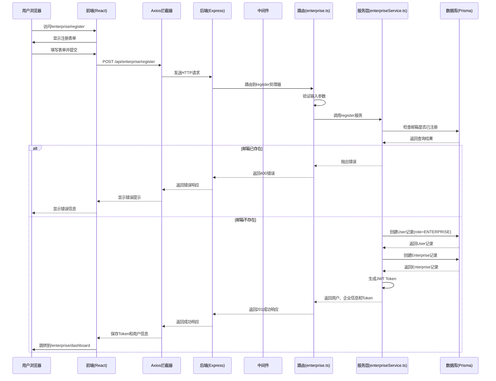
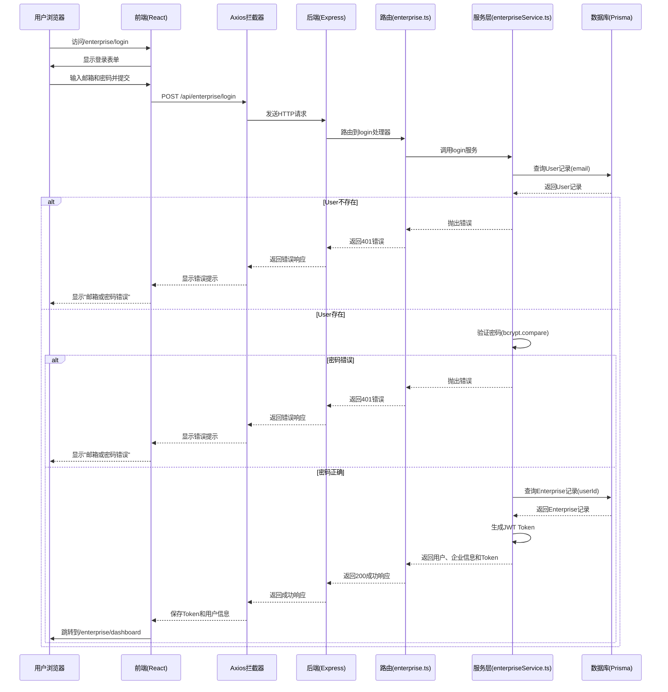
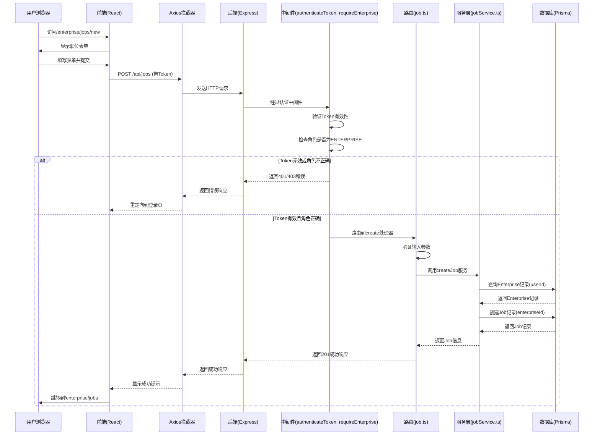

# 简历面试AI助手 - 企业端功能系统架构设计

## 文档信息

| 项目信息 | 内容 |
|---------|------|
| 项目名称 | 简历面试AI助手 |
| 文档版本 | v1.0 |
| 文档状态 | ❌ 已废弃（被 enterprise-architecture.md 替代） |
| 作者 | 高见远（架构师） |
| 创建日期 | 2026-06-05 |
| 更新日期 | 2026-06-05 |

## 1. 实现方案 + 框架选型

### 1.1 技术栈选择

保持与现有项目技术栈一致，确保系统架构的统一性和可维护性。

| 层级 | 技术选型 | 版本 | 说明 |
|------|---------|------|------|
| **前端框架** | React + Vite | React 18.2.0, Vite 5.0.8 | 保持现有框架不变 |
| **前端语言** | TypeScript | 5.2.2 | 类型安全，便于维护 |
| **前端样式** | Tailwind CSS | 3.4.19 | 保持现有样式方案 |
| **前端路由** | React Router DOM | 6.20.0 | 保持现有路由方案 |
| **HTTP客户端** | Axios | 1.6.2 | 保持现有API调用方式 |
| **后端框架** | Express | 4.18.2 | 保持现有框架不变 |
| **后端语言** | TypeScript | 5.3.3 | 类型安全，便于维护 |
| **ORM** | Prisma | 6.19.3 | 保持现有ORM不变 |
| **数据库** | SQLite | 3.x | 保持现有数据库不变 |
| **认证** | JWT (jsonwebtoken) | 9.0.2 | 保持现有认证方案 |
| **密码加密** | bcryptjs | 2.4.3 | 保持现有加密方案 |

### 1.2 架构模式

采用前后端分离架构，保持与现有项目一致的架构模式：

1. **后端架构**：
   - 分层架构：Routes → Controllers → Services → Prisma Client
   - 中间件模式：认证中间件（authenticateToken）+ 权限中间件（requireEnterprise）
   - 错误处理：统一错误处理中间件

2. **前端架构**：
   - 组件化架构：页面组件（pages/）+ 通用组件（components/）
   - 路由守卫：EnterpriseRoute（企业路由守卫）
   - API服务层：enterpriseAPI（企业端API调用封装）
   - 状态管理：LocalStorage（用户信息）+ React State（页面状态）

### 1.3 技术决策

| 决策项 | 决策结果 | 理由 |
|--------|---------|------|
| 企业用户是否独立表 | 否，在User表增加ENTERPRISE角色 | 保持用户体系统一，便于权限管理 |
| 企业信息存储 | 新增Enterprise表，与User表一对一关联 | 企业信息字段较多，独立表更清晰 |
| 职位数据模型 | 新增Job表，与企业（Enterprise）关联 | 符合业务语义，便于扩展 |
| 申请数据模型 | 新增Application表，关联Job和User | 支持候选人申请流程 |
| 企业端路由前缀 | /api/enterprise | 与现有/api/admin保持一致的命名规范 |
| 企业端前端路由 | /enterprise/* | 与现有/admin/*保持一致的命名规范 |

## 2. 文件列表及相对路径

### 2.1 后端文件（新增/修改）

| 文件路径 | 操作 | 说明 |
|---------|------|------|
| `backend/prisma/schema.prisma` | 修改 | 新增Enterprise、Job、Application模型，修改User的Role枚举 |
| `backend/src/routes/enterprise.ts` | 新增 | 企业端API路由（注册、登录、职位管理） |
| `backend/src/routes/job.ts` | 新增 | 职位管理API路由（CRUD） |
| `backend/src/middleware/enterprise.ts` | 新增 | 企业权限中间件（requireEnterprise） |
| `backend/src/services/enterpriseService.ts` | 新增 | 企业端业务逻辑层 |
| `backend/src/services/jobService.ts` | 新增 | 职位管理业务逻辑层 |
| `backend/src/index.ts` | 修改 | 注册企业端路由 |
| `backend/package.json` | 修改 | 无需新增依赖包 |

### 2.2 前端文件（新增/修改）

| 文件路径 | 操作 | 说明 |
|---------|------|------|
| `frontend/src/services/api.ts` | 修改 | 新增enterpriseAPI、jobAPI |
| `frontend/src/App.tsx` | 修改 | 新增企业端路由（EnterpriseRoute） |
| `frontend/src/pages/EnterpriseLogin.tsx` | 新增 | 企业登录页面 |
| `frontend/src/pages/EnterpriseRegister.tsx` | 新增 | 企业注册页面 |
| `frontend/src/pages/EnterpriseDashboard.tsx` | 新增 | 企业控制台首页 |
| `frontend/src/pages/EnterpriseJobs.tsx` | 新增 | 职位管理页面 |
| `frontend/src/pages/EnterpriseJobEdit.tsx` | 新增 | 职位编辑页面（新增/修改） |
| `frontend/src/pages/EnterpriseLayout.tsx` | 新增 | 企业端布局组件 |
| `frontend/src/components/EnterpriseRoute.tsx` | 新增 | 企业端路由守卫组件 |
| `frontend/package.json` | 修改 | 无需新增依赖包 |

### 2.3 文档文件（新增）

| 文件路径 | 操作 | 说明 |
|---------|------|------|
| `docs/架构设计_企业端功能.md` | 新增 | 本文档 |
| `docs/API接口文档_企业端.md` | 新增 | 企业端API接口详细文档（待后续创建） |
| `docs/数据库设计_企业端.md` | 新增 | 企业端数据库设计详细文档（待后续创建） |

## 3. 数据结构和接口（类图）

### 3.1 Prisma Schema设计

```prisma
// Prisma Schema for 简历面试AI助手 - 企业端功能扩展

// 枚举定义（修改）
enum Role {
  USER
  ADMIN
  ENTERPRISE  // 新增：企业角色
}

// 企业模型（新增）
model Enterprise {
  id          String   @id @default(uuid())
  userId      String   @unique @map("user_id")  // 关联用户账号
  name        String   @map("name")              // 企业名称
  description String?  @map("description")      // 企业描述
  logo        String?  @map("logo")              // 企业Logo URL
  website     String?  @map("website")           // 企业官网
  industry    String?  @map("industry")          // 行业
  size        String?  @map("size")              // 企业规模
  location    String?  @map("location")          // 所在地
  contactEmail String?  @map("contact_email")    // 联系邮箱
  contactPhone String?  @map("contact_phone")    // 联系电话
  createdAt   DateTime @default(now()) @map("created_at")
  updatedAt   DateTime @updatedAt @map("updated_at")
  
  // 关联关系
  user        User     @relation(fields: [userId], references: [id])
  jobs        Job[]    // 发布的职位
  
  @@map("enterprises")
}

// 职位模型（新增）
model Job {
  id          String   @id @default(uuid())
  enterpriseId String   @map("enterprise_id")    // 关联企业
  title       String   @map("title")              // 职位标题
  description String   @map("description")        // 职位描述
  requirements String?  @map("requirements")      // 任职要求
  salaryRange String?  @map("salary_range")      // 薪资范围
  location    String?  @map("location")          // 工作地点
  type        String?  @map("type")              // 职位类型（全职/兼职/实习）
  status      JobStatus @default(ACTIVE) @map("status")  // 职位状态
  createdAt   DateTime @default(now()) @map("created_at")
  updatedAt   DateTime @updatedAt @map("updated_at")
  
  // 关联关系
  enterprise  Enterprise  @relation(fields: [enterpriseId], references: [id])
  applications Application[]  // 职位申请
  
  @@map("jobs")
}

// 职位状态枚举（新增）
enum JobStatus {
  ACTIVE    // 活跃（可申请）
  CLOSED    // 已关闭
  DRAFT     // 草稿
}

// 职位申请模型（新增）
model Application {
  id          String        @id @default(uuid())
  jobId       String        @map("job_id")          // 关联职位
  userId      String        @map("user_id")         // 关联候选人（用户）
  resumeId    String?       @map("resume_id")      // 关联简历
  status      ApplicationStatus @default(PENDING) @map("status")  // 申请状态
  coverLetter String?       @map("cover_letter")    // 求职信
  createdAt   DateTime      @default(now()) @map("created_at")
  updatedAt   DateTime      @updatedAt @map("updated_at")
  
  // 关联关系
  job         Job           @relation(fields: [jobId], references: [id])
  user        User          @relation(fields: [userId], references: [id])
  resume      Resume?       @relation(fields: [resumeId], references: [id])
  
  @@unique([jobId, userId])  // 同一用户不能重复申请同一职位
  @@map("applications")
}

// 申请状态枚举（新增）
enum ApplicationStatus {
  PENDING     // 待处理
  REVIEWING   // 审核中
  ACCEPTED    // 已接受
  REJECTED    // 已拒绝
}

// User模型（修改）
model User {
  id          String   @id @default(uuid())
  email       String   @unique @map("email")
  passwordHash String   @map("password_hash")
  name        String?  @map("name")
  avatar      String?  @map("avatar")
  role        Role     @default(USER) @map("role")  // 新增ENTERPRISE枚举值
  status      Status   @default(ACTIVE) @map("status")
  resumes     Resume[]
  interviews  Interview[]
  reports     Report[]
  createdAt   DateTime @default(now()) @map("created_at")
  updatedAt   DateTime @updatedAt @map("updated_at")
  
  // 新增关联关系
  enterprise  Enterprise?  // 企业信息（一对一）
  applications Application[]  // 职位申请（用户作为候选人）
  
  @@map("users")
}
```

### 3.2 API接口定义

#### 3.2.1 企业认证API

| 接口 | 方法 | 路径 | 描述 | 权限 |
|------|------|------|------|------|
| 企业注册 | POST | `/api/enterprise/register` | 企业用户注册 | 公开 |
| 企业登录 | POST | `/api/enterprise/login` | 企业用户登录 | 公开 |
| 获取企业信息 | GET | `/api/enterprise/me` | 获取当前企业信息 | 企业用户 |
| 更新企业信息 | PUT | `/api/enterprise/me` | 更新企业信息 | 企业用户 |

#### 3.2.2 职位管理API

| 接口 | 方法 | 路径 | 描述 | 权限 |
|------|------|------|------|------|
| 创建职位 | POST | `/api/jobs` | 创建新职位 | 企业用户 |
| 获取职位列表 | GET | `/api/jobs` | 获取企业发布的职位列表 | 企业用户 |
| 获取职位详情 | GET | `/api/jobs/:id` | 获取职位详情 | 企业用户 |
| 更新职位 | PUT | `/api/jobs/:id` | 更新职位信息 | 企业用户 |
| 删除职位 | DELETE | `/api/jobs/:id` | 删除职位 | 企业用户 |
| 更新职位状态 | PATCH | `/api/jobs/:id/status` | 更新职位状态（激活/关闭） | 企业用户 |

#### 3.2.3 申请管理API（后续迭代）

| 接口 | 方法 | 路径 | 描述 | 权限 |
|------|------|------|------|------|
| 获取申请列表 | GET | `/api/jobs/:id/applications` | 获取职位的申请列表 | 企业用户 |
| 更新申请状态 | PUT | `/api/applications/:id` | 更新申请状态 | 企业用户 |

### 3.3 前后端接口契约

#### 3.3.1 企业注册接口

**请求：**
```json
POST /api/enterprise/register
Content-Type: application/json

{
  "email": "hr@company.com",
  "password": "password123",
  "name": "张三",
  "enterpriseName": "ABC科技有限公司",
  "industry": "互联网",
  "size": "100-500人",
  "location": "北京"
}
```

**响应：**
```json
{
  "message": "注册成功",
  "user": {
    "id": "uuid",
    "email": "hr@company.com",
    "name": "张三",
    "role": "ENTERPRISE"
  },
  "enterprise": {
    "id": "uuid",
    "name": "ABC科技有限公司",
    "industry": "互联网",
    "size": "100-500人",
    "location": "北京"
  },
  "token": "jwt-token"
}
```

#### 3.3.2 企业登录接口

**请求：**
```json
POST /api/enterprise/login
Content-Type: application/json

{
  "email": "hr@company.com",
  "password": "password123"
}
```

**响应：**
```json
{
  "message": "登录成功",
  "user": {
    "id": "uuid",
    "email": "hr@company.com",
    "name": "张三",
    "role": "ENTERPRISE"
  },
  "enterprise": {
    "id": "uuid",
    "name": "ABC科技有限公司",
    "industry": "互联网",
    "size": "100-500人",
    "location": "北京"
  },
  "token": "jwt-token"
}
```

#### 3.3.3 创建职位接口

**请求：**
```json
POST /api/jobs
Authorization: Bearer jwt-token
Content-Type: application/json

{
  "title": "前端开发工程师",
  "description": "负责公司前端开发工作",
  "requirements": "3年以上前端开发经验",
  "salaryRange": "15k-25k",
  "location": "北京",
  "type": "全职"
}
```

**响应：**
```json
{
  "message": "职位创建成功",
  "job": {
    "id": "uuid",
    "title": "前端开发工程师",
    "description": "负责公司前端开发工作",
    "requirements": "3年以上前端开发经验",
    "salaryRange": "15k-25k",
    "location": "北京",
    "type": "全职",
    "status": "ACTIVE",
    "createdAt": "2026-06-05T10:00:00.000Z"
  }
}
```

## 4. 程序调用流程（时序图）

### 4.1 企业注册流程



### 4.2 企业登录流程



### 4.3 创建职位流程



## 5. 任务列表（有序、含依赖关系、按实现顺序排列）

### 5.1 任务依赖关系图

```
任务1: 数据库Schema设计 (无依赖)
  └─> 任务2: Prisma Migration (依赖任务1)
       └─> 任务3: 后端中间件开发 (依赖任务2)
            └─> 任务4: 后端服务层开发 (依赖任务3)
                 └─> 任务5: 后端路由开发 (依赖任务4)
                      └─> 任务6: 前端API服务层开发 (依赖任务5)
                           └─> 任务7: 前端路由和页面开发 (依赖任务6)
                                └─> 任务8: 集成测试 (依赖任务7)
```

### 5.2 详细任务列表

| 任务ID | 任务名称 | 描述 | 依赖任务 | 预计工作量 | 优先级 |
|--------|---------|------|---------|-----------|--------|
| 1 | 数据库Schema设计 | 修改Prisma Schema，新增Enterprise、Job、Application模型，修改User的Role枚举 | 无 | 2小时 | P0 |
| 2 | Prisma Migration | 运行prisma db push或prisma migrate dev，更新数据库结构 | 任务1 | 1小时 | P0 |
| 3 | 后端中间件开发 | 开发企业权限中间件（requireEnterprise），修改认证中间件支持ENTERPRISE角色 | 任务2 | 2小时 | P0 |
| 4 | 后端服务层开发 | 开发enterpriseService.ts和jobService.ts，实现业务逻辑 | 任务3 | 4小时 | P0 |
| 5 | 后端路由开发 | 开发enterprise.ts和job.ts路由，实现API接口 | 任务4 | 3小时 | P0 |
| 6 | 前端API服务层开发 | 修改api.ts，新增enterpriseAPI和jobAPI | 任务5 | 2小时 | P0 |
| 7 | 前端路由和页面开发 | 开发EnterpriseRoute、Login、Register、Dashboard、Jobs、JobEdit页面 | 任务6 | 6小时 | P0 |
| 8 | 集成测试 | 测试企业注册、登录、职位管理功能 | 任务7 | 3小时 | P0 |
| 9 | 文档编写 | 编写API接口文档、数据库设计文档 | 任务8 | 2小时 | P1 |

### 5.3 任务实现顺序

**第一阶段（P0 - MVP功能）：**
1. 任务1: 数据库Schema设计
2. 任务2: Prisma Migration
3. 任务3: 后端中间件开发
4. 任务4: 后端服务层开发
5. 任务5: 后端路由开发
6. 任务6: 前端API服务层开发
7. 任务7: 前端路由和页面开发
8. 任务8: 集成测试

**第二阶段（P1 - 完善功能）：**
9. 任务9: 文档编写

## 6. 依赖包列表

### 6.1 后端依赖包（新增）

无需新增依赖包。企业端功能可以使用现有依赖包实现。

| 包名 | 版本 | 用途 | 是否已安装 |
|------|------|------|-----------|
| jsonwebtoken | ^9.0.2 | JWT认证 | 是 |
| bcryptjs | ^2.4.3 | 密码加密 | 是 |
| @prisma/client | ^6.19.3 | Prisma客户端 | 是 |

### 6.2 前端依赖包（新增）

无需新增依赖包。企业端功能可以使用现有依赖包实现。

| 包名 | 版本 | 用途 | 是否已安装 |
|------|------|------|-----------|
| axios | ^1.6.2 | HTTP客户端 | 是 |
| react-router-dom | ^6.20.0 | 路由管理 | 是 |

### 6.3 开发依赖包（新增）

无需新增开发依赖包。

## 7. 共享知识（跨文件约定）

### 7.1 代码规范

遵循现有项目的代码规范，保持代码风格一致。

| 规范项 | 规范内容 | 示例 |
|--------|---------|------|
| 文件命名 | 使用小写字母和连字符（kebab-case） | `enterprise-service.ts` |
| 函数命名 | 使用驼峰命名法（camelCase） | `createJob`, `getEnterpriseById` |
| 类型命名 | 使用帕斯卡命名法（PascalCase），接口前缀I可选 | `Enterprise`, `JobResponse` |
| 常量命名 | 使用大写字母和下划线（UPPER_SNAKE_CASE） | `JWT_SECRET`, `MAX_FILE_SIZE` |
| 数据库字段 | 使用下划线分隔（snake_case） | `enterprise_id`, `created_at` |
| API路径 | 使用小写字母和连字符（kebab-case） | `/api/enterprise/login` |

### 7.2 命名约定

| 约定项 | 约定内容 | 示例 |
|--------|---------|------|
| 后端路由前缀 | `/api/enterprise` 用于企业认证相关，`/api/jobs` 用于职位管理 | `/api/enterprise/register`, `/api/jobs` |
| 前端路由前缀 | `/enterprise/*` | `/enterprise/login`, `/enterprise/dashboard` |
| API服务变量 | `enterpriseAPI`, `jobAPI` | `enterpriseAPI.login()`, `jobAPI.create()` |
| 组件命名 | 使用帕斯卡命名法（PascalCase），以功能模块前缀 | `EnterpriseLogin`, `EnterpriseDashboard` |
| 类型定义前缀 | 接口类型使用 `I` 前缀（可选，保持与现有代码一致） | `IEnterprise`, `IJob` |

### 7.3 错误处理约定

遵循现有项目的错误处理模式：

1. **后端错误处理**：
   - 使用 `try-catch` 捕获异常
   - 返回统一的错误响应格式：`{ error: "错误信息" }`
   - 使用适当的HTTP状态码：400（请求错误）、401（未授权）、403（禁止）、404（未找到）、500（服务器错误）

2. **前端错误处理**：
   - 使用 `try-catch` 或 `.catch()` 捕获异常
   - 显示用户友好的错误提示（使用Toast或ErrorAlert组件）
   - 记录错误日志到控制台（`console.error`）

### 7.4 认证和授权约定

遵循现有项目的认证和授权模式：

1. **JWT Token**：
   - 存储在LocalStorage中，key为 `token`
   - 在HTTP请求头中传递：`Authorization: Bearer <token>`
   - Token有效期：7天

2. **用户信息**：
   - 存储在LocalStorage中，key为 `user`
   - 包含字段：`id`, `email`, `name`, `role`

3. **中间件顺序**：
   - 先执行 `authenticateToken`（认证）
   - 再执行 `requireEnterprise`（授权）

### 7.5 数据库操作约定

遵循现有项目的数据库操作模式：

1. **Prisma Client**：
   - 从 `../index` 导入 `prisma` 实例
   - 使用 `prisma.model.operation()` 进行数据库操作

2. **关联关系**：
   - 使用 `include` 加载关联数据
   - 使用 `select` 选择特定字段（推荐用于API响应）

3. **事务处理**：
   - 使用 `prisma.$transaction()` 处理多个数据库操作

## 8. 待明确事项

### 8.1 技术决策待明确

| 事项 | 问题描述 | 建议方案 | 需要确认 |
|------|---------|---------|---------|
| 企业用户审核机制 | 企业注册后是否需要管理员审核才能发布职位？ | 暂时不需要审核，注册后即可发布职位 | 需要产品经理确认 |
| 职位申请流程 | MVP阶段是否需要实现完整的申请流程（候选人申请->企业审核）？ | MVP阶段只实现职位发布和管理，申请流程后续迭代 | 需要产品经理确认 |
| 企业信息审核 | 企业信息（名称、logo等）是否需要审核？ | 暂时不需要审核 | 需要产品经理确认 |
| 文件上传 | 企业是否需要上传营业执照等文件？ | MVP阶段不需要，后续迭代可增加 | 需要产品经理确认 |

### 8.2 业务逻辑待明确

| 事项 | 问题描述 | 建议方案 | 需要确认 |
|------|---------|---------|---------|
| 企业角色权限 | 企业用户是否有子账号（如HR、面试官）？ | MVP阶段只有一个账号，后续迭代可增加子账号 | 需要产品经理确认 |
| 职位数量限制 | 企业可以发布的职位数量是否有限制？ | MVP阶段不限制，后续可根据套餐限制 | 需要产品经理确认 |
| 职位状态流转 | 职位状态如何流转（草稿->激活->关闭）？ | 创建后为草稿，可激活，可关闭 | 需要产品经理确认 |
| 企业控制台功能 | 企业控制台首页需要显示哪些统计数据？ | 显示职位数量、申请数量等 | 需要产品经理确认 |

### 8.3 安全事项待明确

| 事项 | 问题描述 | 建议方案 | 需要确认 |
|------|---------|---------|---------|
| 企业邮箱验证 | 企业注册后是否需要验证邮箱？ | MVP阶段不需要验证，后续迭代可增加 | 需要产品经理确认 |
| 企业域名验证 | 是否需要验证企业邮箱域名（如@company.com）？ | MVP阶段不需要验证 | 需要产品经理确认 |
| API限流 | 企业端API是否需要限流？ | MVP阶段不需要限流，后续迭代可增加 | 需要技术负责人确认 |

## 9. 风险评估

### 9.1 技术风险

| 风险项 | 风险等级 | 风险描述 | 缓解措施 |
|--------|---------|---------|---------|
| 数据库迁移失败 | 中 | Prisma Migration可能失败，导致数据库结构不一致 | 在开发环境先测试，备份数据库 |
| 现有功能受影响 | 高 | 修改User表的Role枚举可能影响现有功能 | 进行完整的回归测试，确保现有功能正常 |
| 认证中间件修改 | 中 | 修改认证中间件支持ENTERPRISE角色可能引入bug | 编写单元测试，覆盖所有角色场景 |

### 9.2 业务风险

| 风险项 | 风险等级 | 风险描述 | 缓解措施 |
|--------|---------|---------|---------|
| 需求变更 | 高 | 产品需求可能变更，导致架构设计需要调整 | 保持架构灵活性，使用分层架构便于修改 |
| 时间延误 | 中 | 开发时间可能超出预期，导致交付延误 | 合理估算工作量，预留缓冲时间 |

## 10. 附录

### 10.1 参考资料

1. [React官方文档](https://react.dev/)
2. [Vite官方文档](https://vitejs.dev/)
3. [TypeScript官方文档](https://www.typescriptlang.org/)
4. [Tailwind CSS官方文档](https://tailwindcss.com/)
5. [Express官方文档](https://expressjs.com/)
6. [Prisma官方文档](https://www.prisma.io/docs)
7. [JWT官方文档](https://jwt.io/)

### 10.2 版本历史

| 版本 | 日期 | 作者 | 变更内容 |
|------|------|------|---------|
| v1.0 | 2026-06-05 | 高见远 | 初始版本 |

---

**文档结束**
