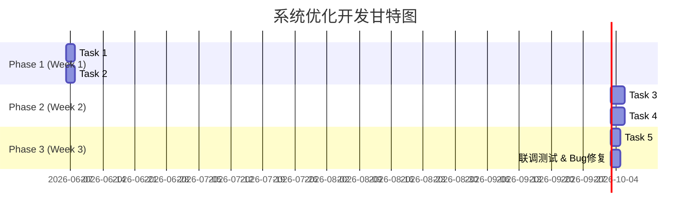

# 系统优化点开发计划

**文档版本**: v1.0
**创建日期**: 2026-06-05
**计划制定人**: 高见远（Bob，arch-optimizer）
**项目**: 简历面试AI助手 - 系统优化

---

## 1. 开发任务总览

基于架构设计文档（系统优化点架构设计.md）的Task 1-5，制定详细开发计划。

### 1.1 任务列表

| 任务ID | 任务名称 | 优先级 | 预估工时 | 依赖任务 | 负责人建议 |
|--------|---------|--------|---------|---------|-----------|
| **Task 1** | P0-4 API频率限制 + P0-2 首页加载优化 | P0 | 2天（16h） | 无 | 后端+前端 |
| **Task 2** | P0-3 前端输入验证 | P0 | 2天（15h） | 无（可与Task 1并行） | 前端 |
| **Task 3** | P0-1 流式响应（SSE）优化报告生成 | P0 | 3天（24h） | Task 1 | 后端+前端 |
| **Task 4** | P1-7 面试引导 + P1-5 报告排版优化 | P1 | 2.5天（18h） | Task 2 | 前端 |
| **Task 5** | P1-6 可视化图表 + P1-8 导出PDF | P1 | 2天（14h） | Task 3 | 前端+后端 |

**总计工时**: 11天（87小时）

---

## 2. 详细任务分解

### Task 1: P0-4 API频率限制 + P0-2 首页加载优化

**优先级**: P0（高）
**预估工时**: 2天（16小时）
**依赖**: 无
**负责人建议**: 后端开发者 + 前端开发者（可并行）

#### 1.1 后端部分（API频率限制）

**文件列表**:
- `backend/src/middleware/rateLimit.ts` (新增)
- `backend/src/index.ts` (修改)
- `backend/src/routes/auth.ts` (修改)
- `backend/src/routes/interview.ts` (修改)

**开发步骤**:

| 步骤 | 描述 | 预估工时 |
|------|------|---------|
| 1.1.1 | 安装 `express-rate-limit` 依赖 | 0.5h |
| 1.1.2 | 创建 `rateLimit.ts` 中间件：定义4个limiter（loginLimiter, registerLimiter, aiLimiter, generalLimiter） | 3h |
| 1.1.3 | 在 `index.ts` 中注册 `generalLimiter` 为全局中间件 | 1h |
| 1.1.4 | 在 `auth.ts` 路由中应用 `loginLimiter` 和 `registerLimiter` | 1h |
| 1.1.5 | 在 `interview.ts` 路由中应用 `aiLimiter` | 1h |
| 1.1.6 | 测试：验证频率限制是否生效（使用Postman或curl） | 1.5h |

**小计**: 8小时

#### 1.2 前端部分（首页加载优化）

**文件列表**:
- `frontend/src/pages/Home.tsx` (修改)
- `frontend/src/App.tsx` (修改)
- `frontend/src/hooks/useLazyLoad.ts` (新增)

**开发步骤**:

| 步骤 | 描述 | 预估工时 |
|------|------|---------|
| 1.2.1 | 检查 `Home.tsx` 的 `useEffect` 逻辑，确认已登录用户跳转 | 1h |
| 1.2.2 | 创建 `useLazyLoad.ts` hook：封装 `React.lazy()` 逻辑 | 2h |
| 1.2.3 | 修改 `App.tsx`：对 `InterviewRoom`, `InterviewReport`, `AdminDashboard` 使用 `React.lazy()` + `Suspense` | 3h |
| 1.2.4 | 测试：验证懒加载是否生效（查看Network面板） | 1.5h |

**小计**: 7.5小时

**Task 1 总计**: 15.5小时 ≈ 2天

---

### Task 2: P0-3 前端输入验证

**优先级**: P0（高）
**预估工时**: 2天（15小时）
**依赖**: 无（可与Task 1并行）
**负责人建议**: 前端开发者

**文件列表**:
- `frontend/src/schemas/resumeSchema.ts` (新增)
- `frontend/src/schemas/interviewSchema.ts` (新增)
- `frontend/src/schemas/answerSchema.ts` (新增)
- `frontend/src/schemas/authSchema.ts` (新增)
- `frontend/src/pages/ResumeUpload.tsx` (修改)
- `frontend/src/pages/InterviewNew.tsx` (修改)
- `frontend/src/pages/InterviewRoom.tsx` (修改)
- `frontend/src/pages/Login.tsx` (修改)
- `frontend/src/pages/Register.tsx` (修改)

**开发步骤**:

| 步骤 | 描述 | 预估工时 |
|------|------|---------|
| 2.1 | 安装依赖：`zod`, `react-hook-form`, `@hookform/resolvers` | 0.5h |
| 2.2 | 创建 `resumeSchema.ts`：验证文件类型（PDF/DOCX）和大小（≤10MB） | 1h |
| 2.3 | 创建 `interviewSchema.ts`：验证面试配置（职位、行业等） | 1h |
| 2.4 | 创建 `answerSchema.ts`：验证回答内容（≤5000字符） | 0.5h |
| 2.5 | 创建 `authSchema.ts`：验证登录/注册表单 | 1h |
| 2.6 | 修改 `ResumeUpload.tsx`：集成 `react-hook-form` + `resumeSchema` | 2h |
| 2.7 | 修改 `InterviewNew.tsx`：集成 `react-hook-form` + `interviewSchema` | 2h |
| 2.8 | 修改 `InterviewRoom.tsx`：集成 `react-hook-form` + `answerSchema` | 2h |
| 2.9 | 修改 `Login.tsx` 和 `Register.tsx`：集成 `react-hook-form` + `authSchema` | 3h |
| 2.10 | 测试：验证所有表单验证是否生效 | 1.5h |

**Task 2 总计**: 15.5小时 ≈ 2天

---

### Task 3: P0-1 流式响应（SSE）优化报告生成

**优先级**: P0（高）
**预估工时**: 3天（24小时）
**依赖**: Task 1（后端基础架构）
**负责人建议**: 后端开发者 + 前端开发者

**文件列表**:
- `backend/src/routes/interview.ts` (修改)
- `backend/src/services/reportService.ts` (新增)
- `frontend/src/pages/InterviewReport.tsx` (修改)
- `frontend/src/hooks/useStreamReport.ts` (新增)

**开发步骤**:

| 步骤 | 描述 | 预估工时 |
|------|------|---------|
| 3.1 | 后端：在 `interview.ts` 中新增 `/:id/report/stream` 端点 | 3h |
| 3.2 | 后端：创建 `reportService.ts`：实现 `generateReportStream()` 方法，调用元器API（stream=true） | 5h |
| 3.3 | 后端：解析元器API的OpenAI兼容SSE格式，转发给前端 | 3h |
| 3.4 | 前端：创建 `useStreamReport.ts` hook：使用 `fetch + ReadableStream` 接收SSE | 4h |
| 3.5 | 前端：修改 `InterviewReport.tsx`：集成 `useStreamReport`，实时显示报告内容 | 5h |
| 3.6 | 测试：验证SSE流式报告生成是否正常 | 2h |

**Task 3 总计**: 22小时 ≈ 3天

---

### Task 4: P1-7 面试引导 + P1-5 报告排版优化

**优先级**: P1（中）
**预估工时**: 2.5天（18小时）
**依赖**: Task 2（前端基础架构）
**负责人建议**: 前端开发者

**文件列表**:
- `frontend/src/pages/InterviewRoom.tsx` (修改)
- `frontend/src/pages/InterviewReport.tsx` (修改)
- `frontend/src/components/QuestionCard.tsx` (新增)
- `frontend/src/components/ScoreBadge.tsx` (新增)

**开发步骤**:

| 步骤 | 描述 | 预估工时 |
|------|------|---------|
| 4.1 | 修改 `InterviewRoom.tsx`：顶部添加进度条（第X题/共Y题） | 2h |
| 4.2 | 修改 `InterviewRoom.tsx`：提交答案后显示"下一题"按钮（非最后一题） | 2h |
| 4.3 | 修改 `InterviewRoom.tsx`：最后一题提交后显示"面试结束"提示和"查看报告"按钮 | 2h |
| 4.4 | 新增 `QuestionCard.tsx` 组件：展示题目和得分（颜色区分） | 3h |
| 4.5 | 新增 `ScoreBadge.tsx` 组件：得分徽章（绿色≥8，黄色≥6，红色<6） | 2h |
| 4.6 | 修改 `InterviewReport.tsx`：优化报告排版（卡片化、颜色区分） | 4h |
| 4.7 | 测试：验证面试引导和报告排版是否正常 | 3h |

**Task 4 总计**: 18小时 ≈ 2.5天

---

### Task 5: P1-6 可视化图表 + P1-8 导出PDF

**优先级**: P1（中）
**预估工时**: 2天（14小时）
**依赖**: Task 3（报告生成逻辑）
**负责人建议**: 前端开发者 + 后端开发者（PDF导出部分）

**文件列表**:
- `frontend/src/components/ReportBarChart.tsx` (新增)
- `frontend/src/components/ReportExportPDF.tsx` (新增)
- `frontend/src/pages/InterviewReport.tsx` (修改)

**开发步骤**:

| 步骤 | 描述 | 预估工时 |
|------|------|---------|
| 5.1 | 新增 `ReportBarChart.tsx` 组件：使用Recharts的BarChart展示各题得分 | 4h |
| 5.2 | 新增 `ReportExportPDF.tsx` 组件：封装PDF导出逻辑（jsPDF + html2canvas） | 4h |
| 5.3 | 修改 `InterviewReport.tsx`：集成 `ReportBarChart` 和 `ReportExportPDF` | 3h |
| 5.4 | 优化PDF导出：支持分页、进度提示 | 2h |
| 5.5 | 测试：验证图表显示和PDF导出是否正常 | 1h |

**Task 5 总计**: 14小时 ≈ 2天

---

## 3. 任务依赖图

**依赖关系**:
- Task 1 和 Task 2 可并行（第1周）
- Task 3 依赖 Task 1（第2周开始）
- Task 4 依赖 Task 2（第2周开始）
- Task 5 依赖 Task 3（第3周开始）

---

## 4. 任务分配建议

### 4.1 团队成员假设

**问题**: 我（arch-optimizer）目前不清楚具体有哪些开发者可用。以下是基于典型团队的假设：

| 角色 | 人数 | 技能 |
|------|------|------|
| 后端开发者 | 1-2人 | Node.js, Express, TypeScript |
| 前端开发者 | 1-2人 | React, TypeScript, Tailwind CSS |
| 全栈开发者 | 1人 | 前后端均可 |

### 4.2 任务分配方案

**方案A：2人团队（1后端 + 1前端）**

| 开发者 | 任务分配 |
|--------|---------|
| **后端开发者** | Task 1（后端部分） + Task 3（后端部分） + Task 5（PDF导出协助） |
| **前端开发者** | Task 1（前端部分） + Task 2 + Task 3（前端部分） + Task 4 + Task 5（前端部分） |

**方案B：3人团队（1后端 + 2前端）**

| 开发者 | 任务分配 |
|--------|---------|
| **后端开发者** | Task 1（后端） + Task 3（后端） |
| **前端开发者A** | Task 1（前端） + Task 2 + Task 4 |
| **前端开发者B** | Task 3（前端） + Task 5 |

**方案C：1人全栈（我本人）**

如果只有我一个人，我可以按顺序完成所有任务（约11天）。

### 4.3 我的能力确认

**问题**: team-lead问我是否能直接修改代码？

**回答**: 
- ✅ **我可以修改代码**：我有文件读写权限，可以直接编辑 `d:\university\competition\soft_design\mygo\` 下的代码文件。
- ✅ **我可以执行命令**：我可以运行 `npm install`, `npm run dev`, `git` 等命令。
- ❓ **需要确认**：team-lead是否需要我直接编码，还是只负责架构设计，由其他开发者实施？

**建议**:
- 如果团队有其他开发者：**我建议我继续担任架构师角色**，负责代码审查和技术指导，让专业开发者实施。
- 如果只有我一个人：**我可以同时担任架构师和开发者**，直接编码实现所有任务。

---

## 5. 风险与缓解措施

| 风险 | 影响 | 缓解措施 |
|------|------|---------|
| 元器API流式响应不稳定 | Task 3 可能无法完成 | 已有降级方案：使用传统响应（已在架构文档中说明"经实测确认支持，无需降级"） |
| 前端表单验证影响用户体验 | Task 2 可能引起用户困惑 | 充分测试，确保错误提示清晰友好 |
| PDF导出样式在不同浏览器不一致 | Task 5 可能效果差 | 使用固定样式模板，测试Chrome/Firefox/Safari |
| 任务依赖导致延期 | 整体进度落后 | 每周评估进度，及时调整任务分配 |

---

## 6. 下一步行动

1. ✅ **开发计划已制定**：本文档
2. ⏳ **等待PRD定稿**：software-product-manager正在处理
3. ⏳ **确认开发团队**：team-lead需要告诉我有哪些开发者可用
4. ⏳ **确认我的角色**：我是架构师还是开发者？还是两者都是？
5. ⏳ **启动开发**：PRD定稿后，按Task 1→Task 2→Task 3→Task 4→Task 5顺序执行

---

**文档状态**: ✅ 已完成，待team-lead确认

**待确认事项**:
1. 开发团队构成（有哪些开发者？）
2. 我的角色定位（架构师 vs 开发者）
3. 开发环境是否已准备好（依赖是否已安装？）
