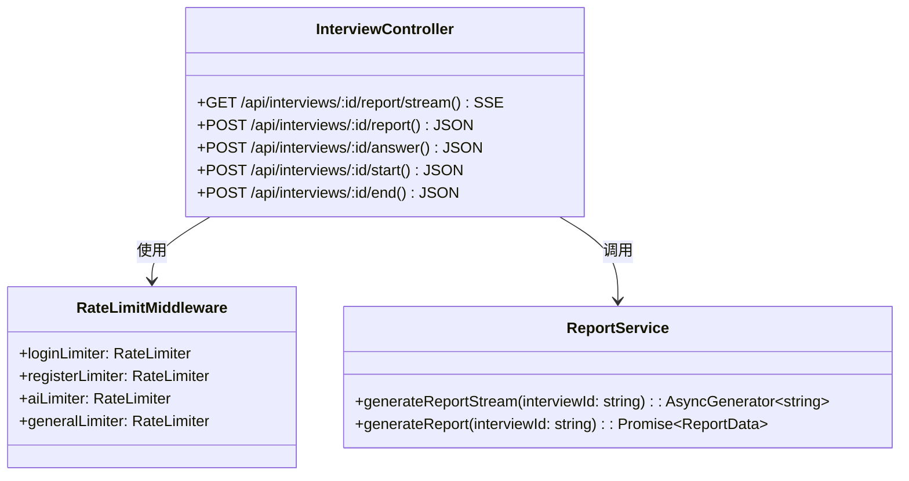
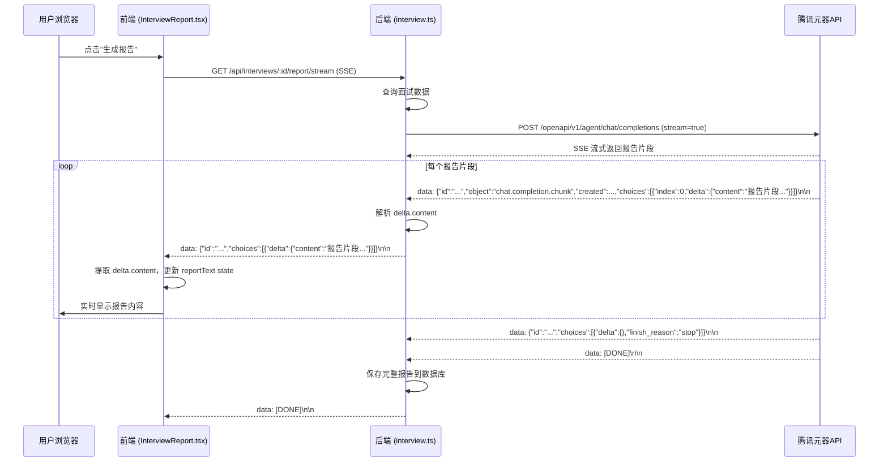
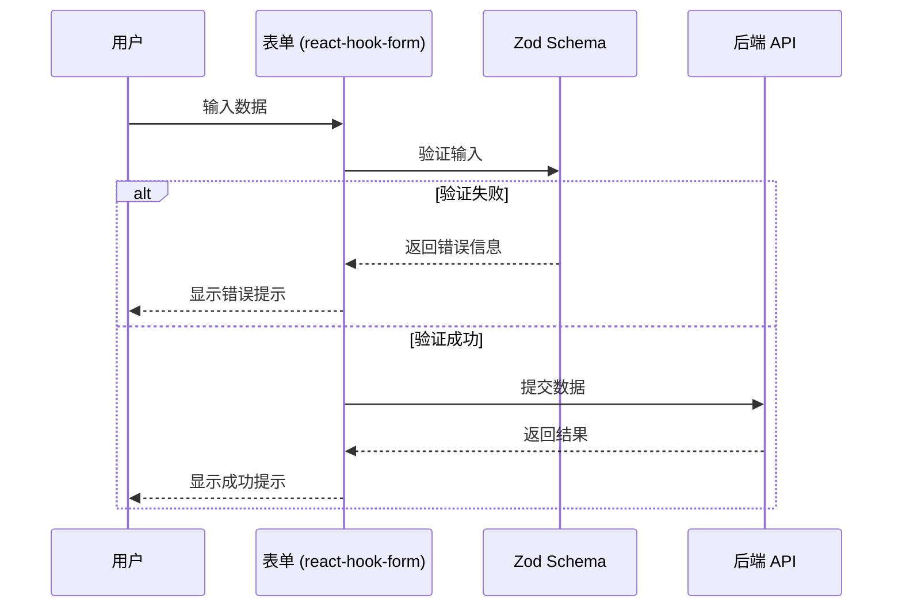
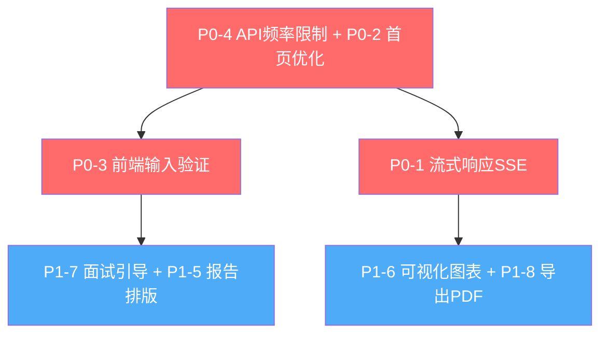

# 系统优化点架构设计

**文档版本**: v1.0
**创建日期**: 2026-06-05
**架构师**: 高见远（Bob）
**项目**: 简历面试AI助手 - 系统优化

---

## Part A: 系统设计

### 1. 实现方案

#### 1.1 P0-1: 流式响应（SSE）优化报告生成速度

**技术难点**：
- 后端需要支持 Server-Sent Events (SSE) 流式响应
- 前端需要使用 EventSource 或 fetch + ReadableStream 接收流式数据
- 腾讯元器 API 支持 `stream: true`（经实测确认）

**实现方案**：
- **后端**：新增 `/api/interviews/:id/report/stream` 端点，使用 SSE 返回流式报告内容
  - 设置响应头：`Content-Type: text/event-stream`, `Cache-Control: no-cache`
  - 调用元器 API 时使用 `stream: true`
  - 解析元器 API 返回的 OpenAI 兼容格式 SSE chunk（`choices[0].delta.content`）
  - 转发给前端时，保持 OpenAI 兼容格式（`data: {id, object, created, choices: [{index, delta: {content}}]}\n\n`）
  - 结束时发送 `data: [DONE]\n\n`（注意：全大写 DONE）
- **前端**：修改 `InterviewReport.tsx`，使用 fetch + ReadableStream 接收流式数据
  - 使用 `useState` 管理流式报告文本
  - 接收过程中实时更新 UI，显示"正在生成..."
  - 接收完成后解析完整报告数据

**框架/库选型**：
- 后端：无需额外库，Express 原生支持 SSE
- 前端：无需额外库，使用原生 fetch API 的 ReadableStream

---

#### 1.2 P0-2: 首页加载优化（代码分割、缓存）

**技术难点**：
- 已登录用户应直接跳转 Dashboard，不展示首页内容（已有实现，需确认）
- 静态资源缓存策略需要配置
- 非首屏组件需要使用 React.lazy() 延迟加载

**实现方案**：
- **已登录用户跳转**：确认 `Home.tsx` 的 `useEffect` 逻辑，已登录用户应直接跳转（当前已实现）
- **静态资源缓存**：在 `backend/src/index.ts` 中配置静态资源缓存头
  ```typescript
  app.use('/assets', express.static('public/assets', {
    maxAge: '1d',
    etag: true
  }));
  ```
- **代码分割**：对非首屏组件使用 React.lazy()
  - `InterviewRoom.tsx` - 面试房间页（懒加载）
  - `InterviewReport.tsx` - 报告页（懒加载）
  - `AdminDashboard.tsx` - 管理后台（懒加载）
  - 使用 `<Suspense fallback={...}>` 包装懒加载组件

**框架/库选型**：
- 无需额外库，使用 React 内置的 `React.lazy()` 和 `Suspense`

---

#### 1.3 P0-3: 前端输入验证（zod + react-hook-form）

**技术难点**：
- 需要为所有用户输入框添加前端验证
- 面试回答输入框需要限制最大长度（5000字符）
- 简历上传需要限制文件类型和大小（PDF/DOCX，最大10MB）

**实现方案**：
- **安装依赖**：`zod`, `@hookform/resolvers`, `react-hook-form`
- **表单验证 schema 定义**：创建 `frontend/src/schemas/` 目录，定义 Zod schemas
  - `resumeSchema.ts` - 简历上传验证
  - `interviewSchema.ts` - 面试创建验证
  - `answerSchema.ts` - 回答提交验证（最大5000字符）
  - `authSchema.ts` - 登录/注册验证
- **集成 react-hook-form**：修改表单组件，使用 `useForm` + `zodResolver`
- **文件上传验证**：在 `ResumeUpload.tsx` 中添加文件类型和大小验证

**框架/库选型**：
- `zod` - TypeScript 优先的模式验证库，提供运行时类型安全
- `react-hook-form` - 高性能表单库，减少重复渲染
- `@hookform/resolvers` - 连接 zod 和 react-hook-form 的适配器

---

#### 1.4 P0-4: API 频率限制（express-rate-limit）

**技术难点**：
- 需要为关键 API 添加频率限制（登录、注册、AI 调用）
- 需要按 IP 或按用户 ID 进行限制

**实现方案**：
- **安装依赖**：`express-rate-limit`
- **创建中间件**：`backend/src/middleware/rateLimit.ts`
  - `loginLimiter` - 登录限制：15分钟内最多5次尝试
  - `registerLimiter` - 注册限制：1小时内最多3次
  - `aiLimiter` - AI调用限制：每分钟最多20次（按 userId 或 IP）
  - `generalLimiter` - 全局限制：每秒最多100个请求
- **应用中间件**：在路由文件中使用 `router.post('/login', loginLimiter, handler)`

**框架/库选型**：
- `express-rate-limit` - Express 最常用的频率限制中间件

---

#### 1.5 P1-5: 报告排版优化（卡片化、颜色区分）

**技术难点**：
- 需要重新设计报告页面布局
- 总分、各题得分、维度评分需要使用视觉化展示
- 关键信息需要使用大字号和醒目颜色高亮

**实现方案**：
- **修改 `InterviewReport.tsx`**：
  - 总分区域：使用大字号和渐变背景（已有实现）
  - 各题得分：使用卡片展示，得分用颜色区分（已有实现，绿色≥8，黄色≥6，红色<6）
  - 改进建议：使用列表展示，每条建议前有图标区分类型（已有实现）
- **新增样式优化**：
  - 使用 Tailwind CSS 实现卡片化和颜色区分
  - 保持现有 Recharts 雷达图，增加柱状图展示各题得分

**框架/库选型**：
- 无需额外库，使用现有 Tailwind CSS 和 Recharts

---

#### 1.6 P1-6: 可视化图表（Recharts 柱状图）

**技术难点**：
- 需要在报告中增加更多可视化图表
- 支持图表导出为图片（PNG）

**实现方案**：
- **新增柱状图组件**：`frontend/src/components/ReportBarChart.tsx`
  - 使用 Recharts 的 `BarChart` 组件
  - 展示各题得分（题目编号 vs 得分）
- **图表导出**：使用 Recharts 自带的 `toBase64Image()` 或 `html2canvas`
- **响应式**：使用 Recharts 的 `ResponsiveContainer`

**框架/库选型**：
- `recharts` - 已安装，无需额外依赖

---

#### 1.7 P1-7: 面试引导（进度条、下一题按钮）

**技术难点**：
- 面试房间页面顶部需要增加进度条
- 每道题结束后需要显示"下一题"按钮
- 面试结束后需要显示结果预览和"查看完整报告"按钮

**实现方案**：
- **修改 `InterviewRoom.tsx`**：
  - 顶部进度条：显示"第X题/共Y题"和进度百分比（已有实现）
  - 提交答案后：显示评价的同时有"下一题"按钮（非最后一题）（需要新增）
  - 最后一题提交后：显示"面试结束"提示和"查看报告"按钮（需要新增）
- **状态管理**：使用 React state 控制按钮显示逻辑

**框架/库选型**：
- 无需额外库

---

#### 1.8 P1-8: 导出 PDF（jsPDF + html2canvas）

**技术难点**：
- 报告页面需要增加"导出PDF"按钮
- PDF 包含完整报告内容，格式清晰，适合打印和分享
- 导出时需要显示进度提示，防止重复点击

**实现方案**：
- **修改 `InterviewReport.tsx`**：
  - 已有 `handleExportPDF` 函数（第404-437行），但需要优化
  - 优化分页逻辑：长报告需要分成多页
  - 导出过程中按钮显示"生成中..."，防止重复点击（已有实现）
- **PDF 样式优化**：使用固定样式模板，测试主流浏览器

**框架/库选型**：
- `jspdf` - 已安装
- `html2canvas` - 已安装

---

### 2. 文件列表

#### 后端文件（从 `backend/src` 开始）

| 文件路径 | 说明 |
|---------|------|
| `routes/interview.ts` | 修改：新增流式报告生成端点 `/:id/report/stream` |
| `middleware/rateLimit.ts` | 新增：API 频率限制中间件 |
| `index.ts` | 修改：配置静态资源缓存头，注册 rateLimit 中间件 |
| `types/report.ts` | 新增：报告相关类型定义 |

#### 前端文件（从 `frontend/src` 开始）

| 文件路径 | 说明 |
|---------|------|
| `pages/InterviewReport.tsx` | 修改：支持流式报告接收，优化 PDF 导出 |
| `pages/InterviewRoom.tsx` | 修改：新增"下一题"按钮，面试结束提示 |
| `pages/Home.tsx` | 修改：确认已登录用户跳转逻辑 |
| `components/ReportBarChart.tsx` | 新增：各题得分柱状图组件 |
| `components/ReportExportPDF.tsx` | 新增：PDF 导出逻辑封装 |
| `schemas/resumeSchema.ts` | 新增：简历上传验证 schema |
| `schemas/interviewSchema.ts` | 新增：面试创建验证 schema |
| `schemas/answerSchema.ts` | 新增：回答提交验证 schema |
| `schemas/authSchema.ts` | 新增：登录/注册验证 schema |
| `hooks/useLazyLoad.ts` | 新增：代码分割懒加载 hook |
| `App.tsx` | 修改：配置 React.lazy() 和 Suspense |

**总计文件数**：17 个文件（4 个后端 + 13 个前端）

---

### 3. 数据结构与接口

#### 3.1 后端 API 接口（Mermaid classDiagram）



#### 3.2 前端组件结构（Mermaid classDiagram）

```mermaid
classDiagram
    class InterviewReport {
        +reportData: ReportData
        +streaming: boolean
        +handleExportPDF()
        +handleStreamReport()
    }
    
    class InterviewRoom {
        +currentQuestion: string
        +answer: string
        +showNextButton: boolean
        +handleSubmitAnswer()
        +handleNextQuestion()
    }
    
    class ReportBarChart {
        +data: Array~{question: string, score: number}~
        +exportAsImage(): Promise~string~
    }
    
    class ReportExportPDF {
        +export(reportRef: RefObject~HTMLDivElement~): Promise~void~
    }
    
    InterviewReport --> ReportBarChart : 包含
    InterviewReport --> ReportExportPDF : 使用
    InterviewRoom --> InterviewReport : 导航到
```

---

### 4. 程序调用流程

#### 4.1 流式报告生成流程（Mermaid sequenceDiagram）



#### 4.2 前端输入验证流程（Mermaid sequenceDiagram）



---

### 5. 待明确事项

#### 5.1 腾讯元器 API 流式响应格式确认

**状态**：✅ 已确认（2026-06-05 实测）

**结论**：腾讯元器 API 支持 `stream: true`，返回 OpenAI 兼容格式：

```
data: {"id":"...","object":"chat.completion.chunk","created":1780644098,"choices":[{"index":0,"delta":{"content":"..."}}]}
data: {"id":"...","choices":[{"delta":{},"finish_reason":"stop"}]}
data: [DONE]
```

**关键字段**：
- `choices[0].delta.content` - 报告内容片段
- `choices[0].finish_reason` - 结束原因（`"stop"` 表示正常结束）
- `data: [DONE]` - 流结束标记（全大写）

**前端解析方式**：使用 `fetch + ReadableStream`，逐行解析 `data:` 前缀后的 JSON，提取 `delta.content`。

#### 5.3 前端缓存策略（P2 功能，本次不实现）

**问题**：分享链接的报告，是否允许被分享者下载 PDF 或再次分享？

**选项**：
- A. 只允许在线查看，不允许下载和再次分享（最安全）
- B. 允许下载 PDF，但不允许再次分享
- C. 允许下载和再次分享（最开放）

**建议**：采用方案 A，最大程度保护原作者隐私（P2 功能，本次不实现）。

#### 5.3 前端缓存策略（P2 功能，本次不实现）

**问题**：是否引入 SWR 或 React Query 实现 API 数据缓存？

**选项**：
- A. 引入 SWR/React Query（增加 bundle 大小）
- B. 手动实现简单缓存（localStorage + 过期时间）

**建议**：P2 功能，本次不实现。如果未来需要实现，建议采用方案 B（手动实现简单缓存）。

---

## Part B: 任务分解

### 6. 依赖包列表

#### 6.1 后端新增依赖

| 包名 | 版本 | 说明 |
|------|------|------|
| `express-rate-limit` | ^7.4.0 | API 频率限制中间件 |

#### 6.2 前端新增依赖

| 包名 | 版本 | 说明 |
|------|------|------|
| `zod` | ^3.23.8 | TypeScript 优先的模式验证库 |
| `react-hook-form` | ^7.53.0 | 高性能表单库 |
| `@hookform/resolvers` | ^3.9.0 | 连接 zod 和 react-hook-form 的适配器 |

**总计新增包数**：4 个（1 个后端 + 3 个前端）

---

### 7. 任务列表

#### 任务 1: P0-4 API 频率限制 + P0-2 首页加载优化

**优先级**：高

**依赖**：无

**文件列表**：
- `backend/src/middleware/rateLimit.ts` (新增)
- `backend/src/index.ts` (修改)
- `backend/src/routes/auth.ts` (修改)
- `backend/src/routes/interview.ts` (修改)
- `frontend/src/pages/Home.tsx` (修改)
- `frontend/src/App.tsx` (修改)
- `frontend/src/hooks/useLazyLoad.ts` (新增)

**说明**：
- 实现 API 频率限制中间件（登录、注册、AI 调用）
- 优化首页加载：确认已登录用户跳转逻辑，配置静态资源缓存，实现代码分割

---

#### 任务 2: P0-3 前端输入验证

**优先级**：高

**依赖**：任务 1（无硬依赖，可并行）

**文件列表**：
- `frontend/src/schemas/resumeSchema.ts` (新增)
- `frontend/src/schemas/interviewSchema.ts` (新增)
- `frontend/src/schemas/answerSchema.ts` (新增)
- `frontend/src/schemas/authSchema.ts` (新增)
- `frontend/src/pages/ResumeUpload.tsx` (修改)
- `frontend/src/pages/InterviewNew.tsx` (修改)
- `frontend/src/pages/InterviewRoom.tsx` (修改)
- `frontend/src/pages/Login.tsx` (修改)
- `frontend/src/pages/Register.tsx` (修改)

**说明**：
- 安装 zod + react-hook-form
- 定义所有表单验证 schema
- 修改表单组件，集成 react-hook-form + zod 验证

---

#### 任务 3: P0-1 流式响应（SSE）优化报告生成速度

**优先级**：高

**依赖**：任务 1（后端基础架构）

**文件列表**：
- `backend/src/routes/interview.ts` (修改)
- `backend/src/services/reportService.ts` (新增)
- `frontend/src/pages/InterviewReport.tsx` (修改)
- `frontend/src/hooks/useStreamReport.ts` (新增)

**说明**：
- 后端新增流式报告生成端点（`/api/interviews/:id/report/stream`）
- 前端修改报告页面，使用 `fetch + ReadableStream` 接收 OpenAI 兼容格式的 SSE 数据
- 经实测确认：元器 API 支持 `stream: true`，返回 OpenAI 兼容格式，无需降级方案

---

#### 任务 4: P1-7 面试引导（进度条、下一题按钮）+ P1-5 报告排版优化

**优先级**：中

**依赖**：任务 2（前端基础架构）

**文件列表**：
- `frontend/src/pages/InterviewRoom.tsx` (修改)
- `frontend/src/pages/InterviewReport.tsx` (修改)
- `frontend/src/components/QuestionCard.tsx` (新增)
- `frontend/src/components/ScoreBadge.tsx` (新增)

**说明**：
- 面试房间页：新增"下一题"按钮，面试结束提示
- 报告页：优化排版，卡片化设计，颜色区分

---

#### 任务 5: P1-6 可视化图表（Recharts 柱状图）+ P1-8 导出 PDF

**优先级**：中

**依赖**：任务 3（报告生成逻辑）

**文件列表**：
- `frontend/src/components/ReportBarChart.tsx` (新增)
- `frontend/src/components/ReportExportPDF.tsx` (新增)
- `frontend/src/pages/InterviewReport.tsx` (修改)

**说明**：
- 新增柱状图组件，展示各题得分
- 优化 PDF 导出逻辑，支持分页

---

### 8. 共享知识

#### 8.1 API 响应格式规范

**成功响应**：
```typescript
{
  data: T,          // 响应数据
  message: string,   // 成功消息
  mock?: boolean     // 是否为模拟模式（可选）
}
```

**错误响应**：
```typescript
{
  error: string,     // 错误信息
  code?: string      // 错误码（可选）
}
```

**频率限制错误响应**（429）：
```typescript
{
  error: string,     // "尝试次数过多，请15分钟后再试"
  retryAfter: number  // 重试等待时间（秒）
}
```

#### 8.2 错误码规范

| 错误码 | HTTP 状态码 | 说明 |
|--------|-------------|------|
| `UNAUTHORIZED` | 401 | 未授权 |
| `FORBIDDEN` | 403 | 禁止访问 |
| `NOT_FOUND` | 404 | 资源不存在 |
| `RATE_LIMIT` | 429 | 频率限制 |
| `VALIDATION_ERROR` | 400 | 输入验证失败 |
| `INTERNAL_ERROR` | 500 | 内部服务器错误 |

#### 8.3 前端表单验证规范

**Zod Schema 定义规范**：
- 文件位置：`frontend/src/schemas/*.ts`
- 命名规范：`{功能}Schema.ts`（如 `resumeSchema.ts`）
- 导出规范：使用 `z.infer<typeof schema>` 导出 TypeScript 类型

**示例**：
```typescript
// frontend/src/schemas/answerSchema.ts
import { z } from 'zod';

export const answerSchema = z.object({
  answer: z.string()
    .min(1, '回答不能为空')
    .max(5000, '回答不能超过5000字符'),
});

export type AnswerFormData = z.infer<typeof answerSchema>;
```

#### 8.4 后端 API 路由规范

**路由命名规范**：
- GET `/api/resource` - 获取列表
- GET `/api/resource/:id` - 获取单个资源
- POST `/api/resource` - 创建资源
- PUT `/api/resource/:id` - 更新资源
- DELETE `/api/resource/:id` - 删除资源
- POST `/api/resource/:id/action` - 执行操作（如 `start`, `answer`, `report`）

**SSE 端点命名规范**：
- `GET /api/resource/:id/action/stream` - 流式操作端点

---

### 9. 任务依赖图



**说明**：
- **Task 1** (P0-4 + P0-2)：基础架构，无依赖，可首先开始
- **Task 2** (P0-3)：与 Task 1 无硬依赖，可并行开发
- **Task 3** (P0-1)：依赖 Task 1 的后端基础架构
- **Task 4** (P1-7 + P1-5)：依赖 Task 2 的前端基础架构
- **Task 5** (P1-6 + P1-8)：依赖 Task 3 的报告生成逻辑

**开发顺序建议**：
1. Task 1 和 Task 2 可并行开发（第 1 周）
2. Task 3 在 Task 1 完成后开始（第 1-2 周）
3. Task 4 在 Task 2 完成后开始（第 2 周）
4. Task 5 在 Task 3 完成后开始（第 3 周）

---

## 附录

### A.1 技术栈总览

| 层级 | 技术栈 |
|------|--------|
| **前端** | React 18 + Vite + TypeScript + Tailwind CSS |
| **后端** | Express + TypeScript + Prisma ORM + SQLite |
| **AI** | 腾讯元器 API |
| **认证** | JWT Token |
| **图表** | Recharts |
| **PDF** | jsPDF + html2canvas |
| **表单** | react-hook-form + zod |
| **限流** | express-rate-limit |

### A.2 开发排期建议（系统优化 MVP）

| 阶段 | 任务 | 工期 | 负责人 |
|------|------|------|--------|
| **Week 1** | Task 1: P0-4 + P0-2 | 2天 | 后端+前端 |
| **Week 1** | Task 2: P0-3 | 2天 | 前端 |
| **Week 2** | Task 3: P0-1 | 3天 | 后端+前端 |
| **Week 2** | Task 4: P1-7 + P1-5 | 2天 | 前端 |
| **Week 3** | Task 5: P1-6 + P1-8 | 3天 | 前端+后端 |
| **Week 3** | 联调测试 & Bug修复 | 2天 | 全员 |

**总计**：3 周（15 个工作日）

---

**文档状态**：✅ 已完成，已评审

**下一步行动**：
1. 拆解任务到具体开发任务卡
2. 启动系统优化开发
3. 按Task 1→Task 2→Task 3→Task 4→Task 5顺序执行
